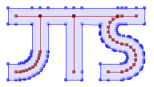

JTS Topology Suite
==================

The JTS Topology Suite is a Java library for creating and manipulating vector geometry.  It also provides a comprehensive set of geometry test cases, and the TestBuilder GUI application for working with and visualizing geometry and JTS functions.

 

JTS is a project in the [LocationTech](http://www.locationtech.org) working group of the Eclipse Foundation.

 

## Locations

### Code
* [GitHub Repo](https://github.com/locationtech/jts)
* [Maven Central group](https://mvnrepository.com/artifact/org.locationtech.jts)

### Websites
* [LocationTech Home](https://locationtech.org/projects/technology.jts)
* [GitHub web site](https://locationtech.github.io/jts/)

### Communication
* [Mailing List](https://locationtech.org/mailman/listinfo/jts-dev)
* [Gitter Channel](https://gitter.im/locationtech/jts)

## License

JTS is open source software.  It is dual-licensed under:

* [Eclipse Public License 1.0](https://www.eclipse.org/legal/epl-v10.html)
* [Eclipse Distribution License 1.0](http://www.eclipse.org/org/documents/edl-v10.php) (a BSD Style License)

See also:

* [License details](LICENSES.md)
* Licensing [FAQ](FAQ-LICENSING.md)

## Documentation

* [**Javadoc**](https://locationtech.github.io/jts/javadoc) for the latest version of JTS
* [**FAQ**](https://locationtech.github.io/jts/jts-faq.html) - Frequently Asked Questions 
* [**User Guide**](USING.md) - Installing and using JTS (as a library and using included tools)
* [**Developing Guide**](DEVELOPING.md) - how to build and develop for JTS
* [**Upgrade Guide**](MIGRATION.md) - How to migrate from previous versions of JTS

## History

* History from the previous JTS SourceForge repo is in the branch [`_old/history`](https://github.com/locationtech/jts/tree/_old/history)
* Older versions of JTS can be found on SourceForge and [here](https://github.com/dr-jts/jts-versions)

## Contributing

If you are interested in contributing to JTS please read the [**Contributing Guide**](CONTRIBUTING.md).

## Downstream Projects

### Derivative (ports to other languages)
* [**GEOS**](https://trac.osgeo.org/geos) - C++
* [**NetTopologySuite**](https://github.com/NetTopologySuite/NetTopologySuite) - .NET
* [**JSTS**](https://github.com/bjornharrtell/jsts) - JavaScript

### Via GEOS
* [**Shapely**](https://github.com/Toblerity/Shapely) - Python wrapper of GEOS
* [**R-GEOS**](https://cran.r-project.org/web/packages/rgeos/index.html) - R wrapper of GEOS
* [**rgeo**](https://github.com/rgeo/rgeo) - Ruby wrapper of GEOS
* [**GEOSwift**](https://github.com/GEOSwift/GEOSwift)- Swift library using GEOS

