# JTS Topology Suite Developer’s Guide

## Overview

The JTS Topology Suite is a Java API that implements a core set of spatial data operations  using an explicit precision model and robust geometric algorithms. It provides a complete  model for specifying 2-D linear Geometry. Many common operations in computational  geometry and spatial data processing are exposed in a clear, consistent and integrated API.  JTS is intended to be used in the development of applications that support the validation,  cleaning, integration and querying of spatial datasets.  

This document is intended for developers who would like to use JTS to accomplish their  spatial data processing requirements. It describes common uses of the JTS API and gives  code examples. 

### Resources

* *OpenGIS Simple Features Specification For SQL Revision 1.1* (referred to as SFS in this  document). The reference specification for the spatial data model and the spatial  predicates and functions implemented by JTS.   
* *JTS Technical Specifications*. The design specification for the classes, methods and  algorithms implemented in the JTS Topology Suite.   
* *JTS JavaDoc*. Documentation for all of the packages, classes and methods in JTS. 

## Getting Started

The most common JTS tasks involve creating and using `Geometry` objects. The easiest way  to create a `Geometry` by hand is to use a `WKTReader` to generate one from a Well-Known  Text (WKT) string. For example: 

```java
Geometry g1 = new WKTReader().read("LINESTRING (0 0, 10 10, 20 20)"); 
```

A specification for WKT is given in the *JTS Technical Specifications*. Many examples of WKT may be found in the files in the *test* directory. 

In a real program, it’s better to use a `GeometryFactory`, because you don’t need to build up  a WKT string; rather, you work with the objects directly: 

```java
Coordinate[] coordinates = new Coordinate[] {
  new Coordinate(0, 0), new Coordinate(10, 10), new Coordinate(20, 20) };
Geometry g1 = new GeometryFactory().createLineString(coordinates);
```

Once you’ve made a Geometry, there are many things you can do with it. You can easily  find the intersection of two geometries: 

```java
Geometry g3 = g1.intersection(g2); 
```

Other computations built into Geometries include: area, envelope, centroid, and buffer. For  more information 
about what a Geometry can do, see the JavaDoc for Geometry in the  `org.loctiontech.jts.geom`
package, as well as subsequent sections in this document. 

## Spatial Relationships

An important application of JTS is computing the spatial relationships between Geometries. Various methods of computing relationships are provided. JTS follows the **Dimensionally Extended 9 Intersection Matrix** model specified by the OGC. To compute the DE-9IM for  two Geometries, use the relate method: 

```java
Geometry a = ...
Geometry b = ...
IntersectionMatrix m = a.relate(b);
```

Most relationships of interest can be specified as a pattern which matches a set of  intersection matrices. JTS also provides a set of boolean predicates which compute  common spatial relationships directly. These are: 

| *Method*  | *Meaning* |
| ----- | ----- |
| Equals  | The Geometries are topologically equal |
| Disjoint  | The Geometries have no point in common |
| Intersects  | The Geometries have at least one point in common (the inverse of Disjoint) |
| Touches  | The Geometries have at least one boundary point in common, but no  interior points |
| Crosses  | The Geometries share some but not all interior points, and the dimension  of the intersection is less than that of at least one of the Geometries. |
| Within  | Geometry A lies in the interior of Geometry B |
| Contains  | Geometry B lies in the interior of Geometry A (the inverse of Within) |
| Overlaps  | The Geometries share some but not all points in common, and the  intersection has the same dimension as the Geometries themselves |

In some cases the precise definition of the predicates is subtle. You should refer to the JTS  Technical Specifications to determine exactly what will be returned in any given case. 

## Overlay Operations

The previous section discussed functions that return true or false, like Intersects and  Contains. We will now present the JTS **overlay operations**, some of which are illustrated  in Figure 4-1 below.  

| Overlay | | |
| :---: | :---: | :---: |
| 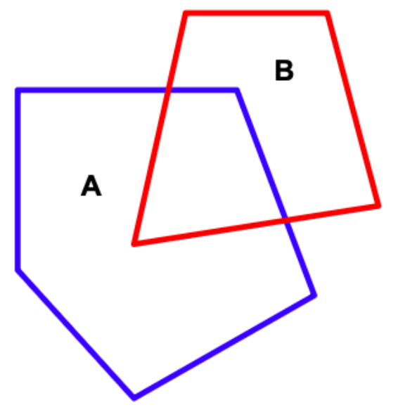 | 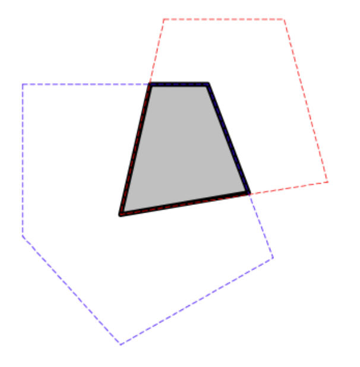 | 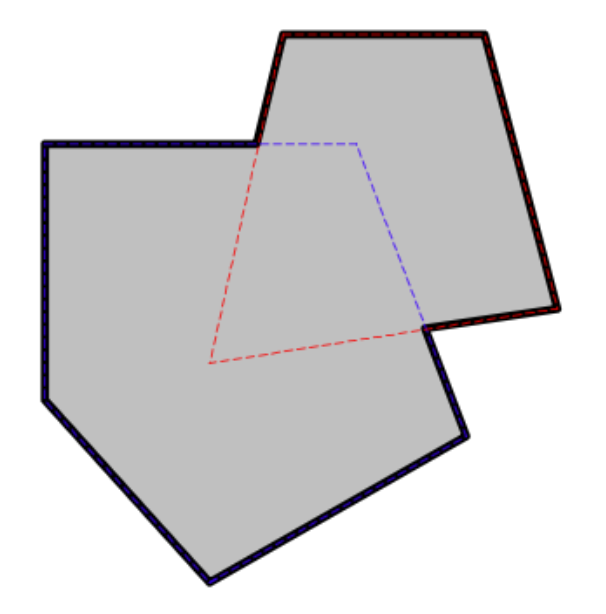 |
| | A.intersection(B)  | A.union(B) |
| 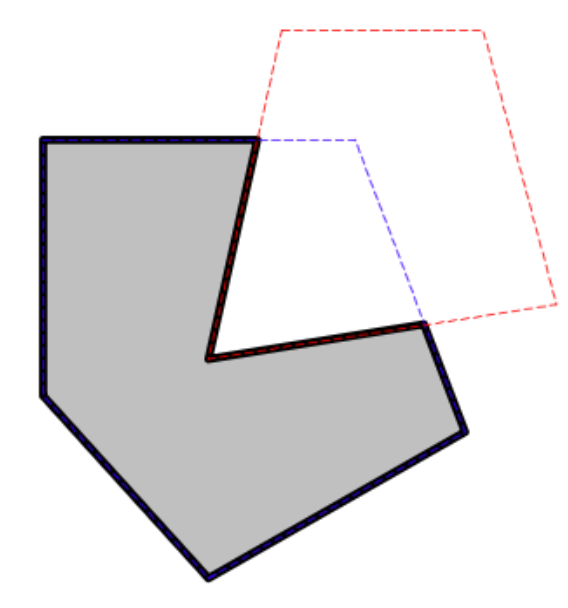 | 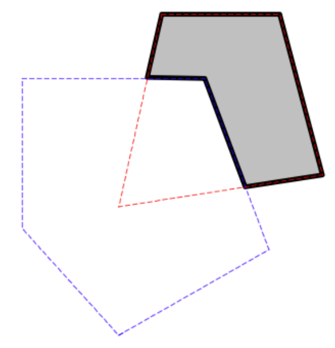 | 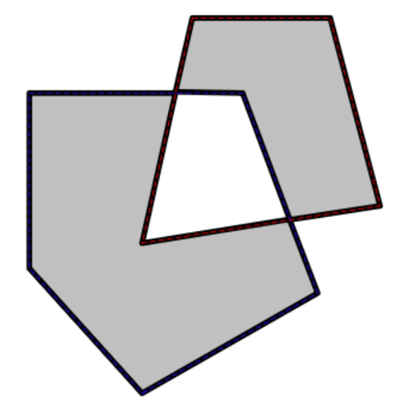 |
|  A.difference(B)  | B.difference(A) | A.symDifference(B) |

**Figure 4-1 – Overlay Operations** 

Descriptions for the overlay operations are tabulated below. 

| *Method*  | *Meaning* |
| ----- | ----- |
| Buffer  | The Polygon or MultiPolygon which contains all points within a specified  distance of the Geometry. For more information, see *5 Computing Buffers* on page 7. |
| ConvexHull  | The smallest convex Polygon that contains all the points in the Geometry. |
| Intersection  | The intersection of two Geometries A and B is the set of all points which lie  in both A and B. |
| Union  | The union of two Geometries A and B is the set of all points which lie in A  or B. |
| Difference  | The difference between two Geometries A and B is the set of all points  which lie in A but not in B. |
| SymDifference  | The symmetric difference of two Geometries A and B is the set of all points  which lie in either A or B but not both. |

As with the spatial relationships described in the previous section, these overlay operations  have precise definitions given in the JTS Technical Specifications. 

## Buffering

In GIS, buffering is an operation which in GIS is used to compute the area containing all  points within a given distance of a Geometry. In mathematical terms, this is called  computing the **Minkowski sum** of the Geometry with a disc of radius equal to the buffer  distance. Finding positive and negative buffers is sometimes referred to as the operations  of **erosion** and **dilation**. In CAD/CAM buffer curves are called **offset curves**. 

You can use JTS to compute the **buffer** of a Geometry using the
Geometry buffer method  or the `BufferOp` class. The input Geometry
to the buffer operation may be of any type  (including arbitrary
`GeometryCollection`s). The result of a buffer operation is always an area
type (`Polygon` or `MultiPolygon`). The result may be empty (for example,
a negative buffer  of a `LineString`).

You can compute buffers with both positive and negative buffer
distances. Buffers with a  positive buffer distance always contain the
input `Geometry`. Buffers with a negative buffer  distance are always
contained within the input `Geometry`. A negative buffer of a  `LineString`
or a `Point` results in an empty `Geometry`.

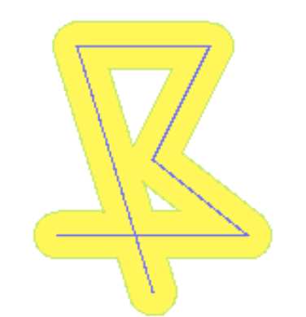 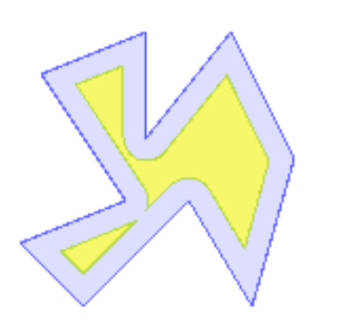

**Figure 5-1 – Positive and Negative Buffers** 

Buffer distances of 0 are also supported. You can use this to perform an efficient union of  multiple polygons. 

### Basic Buffers

To compute a buffer for a given distance, call the `buffer()` method on the `Geometry`: 

```java
Geometry g = ...
Geometry buffer = g.buffer(100.0);
```

### End Cap Styles

Buffer polygons can be computed with different line **end cap
styles**. The end cap style  determines how the line work for the buffer
polygon is constructed at the ends of `lineString`s.  The following
different kinds of end cap styles are supported:

| *Style Name*  | *Description* |
| :---- | :---- |
| CAP_ROUND  | The usual round end caps |
| CAP_BUTT  | End caps are truncated flat at the line ends |
| CAP_SQUARE  | End caps are squared off at the buffer distance beyond the line ends |

The following diagrams illustrate the effects of specifying different end cap styles: 

| 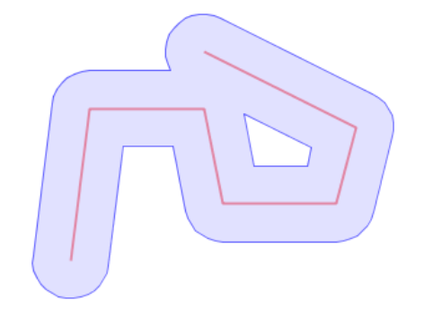 | 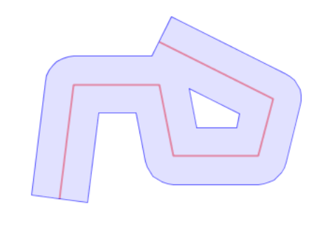 | 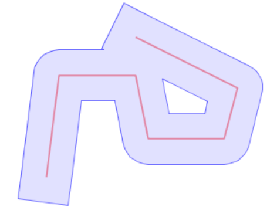 |
| :---: | :---: | :---: |
| **CAP_ROUND**  | **CAP_BUTT**  | **CAP_SQUARE** |

**Figure 5-2 \- Different End Cap Styles** 

To specify the buffer end cap style, the `BufferOp` class in the package  

`org.locationtech.jts.operation.buffer` is used directly: 

```java
Geometry g = ...
BufferOp bufOp = new BufferOp(g);
bufOp.setEndCapStyle(BufferOp.CAP_BUTT);
Geometry buffer = bufOp.getResultGeometry(distance);
```

### Quantization Approximation 

Since the exact buffer outline of a Geometry usually contains circular
sections, the buffer must be approximated by the linear Geometry
supported by JTS. The degree of  approximation may be controlled by the
user. In JTS this is done by specifying the number  of quadrant segments
used to approximate a quarter-circle. Specifying a larger number of
segments results in a better approximation to the actual area, but also
results in a larger  number of line segments in the computed polygon.

To specify a value for the quadrant segments, use the Geometry buffer method with a  second argument: 

```java
Geometry g = ...
Geometry buffer = g.buffer(100.0, 16);
```

The default number of segments is 8. This gives less than a 2% maximum error in the  distance of the computed curve approximation to the actual buffer curve. This error can be  reduced to less than 1% by using a value of 12. The diagram below shows the effect of  increasing the number of approximation curve segments. 

| 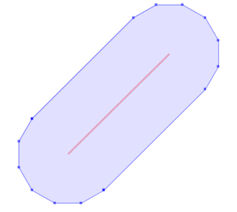 |  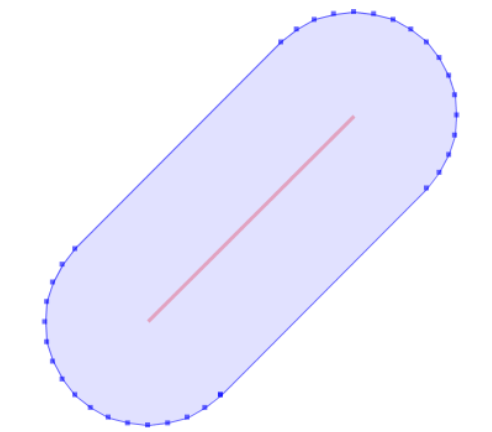 |  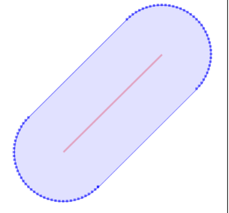 |
| :---: | :---: | :---: |
| ***Quadrant Segments = 3***  | ***Quadrant Segments = 8  (default)*** | ***Quadrant Segments = 20*** |

**Figure 5-3 \- Using Different Curve Approximation Levels** 

## Polygonization

Polygonization is the process of forming polygons from linework which encloses areas.  Linework to be formed into polygons must be fully noded – that is, linestrings must not  cross and must touch only at endpoints.  

JTS provides the `Polygonizer` class to perform polygonization. The `Polygonizer` takes a set  of fully noded 
LineStrings and forms all the polygons which are enclosed by the lines.  Polygonization errors such as 
dangling lines or cut lines can be identified and reported.  

```java
Collection lines = new ArrayList(); 

lines.add(read("LINESTRING (0 0 , 10 10)"));
// isolated edge lines.add(read("LINESTRING (185 221, 100 100)"));
//dangling edge lines.add(read("LINESTRING (185 221, 88 275, 180 316)")); 

lines.add(read("LINESTRING (185 221, 292 281, 180 316)"));   
lines.add(read("LINESTRING (189 98, 83 187, 185 221)"));   
lines.add(read("LINESTRING (189 98, 325 168, 185 221)"));   
polygonizer.add(lines); 

Collection polys = polygonizer.getPolygons();   
Collection dangles = polygonizer.getDangles();   
Collection cuts = polygonizer.getCutEdges(); 
```

If the set of lines is not correctly noded the Polygonizer will still operate on them, but the  resulting polygonal Geometries will not be valid. The MultiLineString union technique can be  used to node a set of LineStrings (see *9.1 Noding A Set Of LineStrings* on page 11). 

| 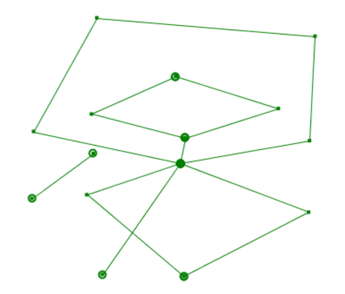 | 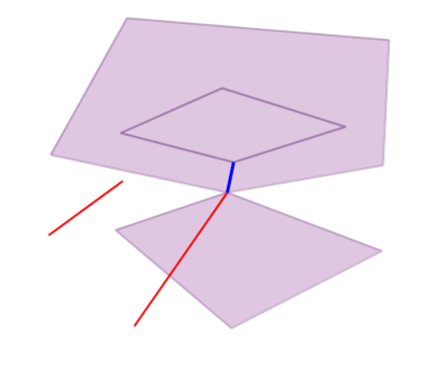 |
| :---: | :---: |
| ***Input – a set of fully noded LineStrings***  | ***Output – Polygons, dangling lines and  cut lines*** |

**Figure 6-1 \- The Polygonization Operation** 

## Merging Lines

Sometimes a spatial operation such as \#union will produce chains of small LineStrings.  The JTS LineMerger is a simple utility to sew these small LineStrings together, as shown  below. 

| 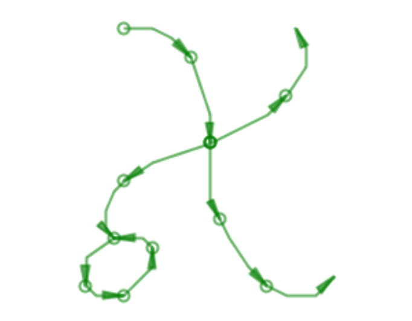 | 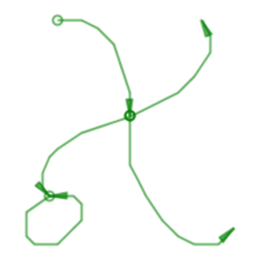 |
| :---: | :---: |
| ***Input – a set of fully noded LineStrings***  | ***Output – Merged LineStrings*** |

**Figure 7-1 – The Line-Merging Operation** 

The `LineMerger` assumes that the input `LineStrings` are *noded* (i.e. they do not cross;  only their endpoints can touch. See *9.1 Noding A Set Of `LineStrings`* on page 11). Note that  the output `LineStrings` 
are also noded.

If `LineStrings` to be merged do not have the same direction, the direction of the resulting  `LineString` 
will be that of the majority. 

The `LineMerger` is used as follows: 

```java
LineMerger lineMerger = new LineMerger();   
Collection lineStrings = . . .   
lineMerger.add(lineStrings);   
Collection mergedLineStrings = lineMerger.getMergedLineStrings(); 
```

## Custom Coordinate Sequences

By default JTS uses arrays of Coordinates to represent the points and lines of Geometries.  There are some cases in which you might want Geometries to store their points using some  other implementation. For example, to save memory you may want to use a more  compact sequence implementation, such as an array of x’s and an array of y’s. Another  possibility is to use a custom coordinate class to store extra information on each coordinate,  such as measures for linear referencing. 

You can do this by implementing the `CoordinateSequence` and
`CoordinateSequenceFactory` interfaces. You would then create a `GeometryFactory` parameterized by your 
`CoordinateSequenceFactory`, and use this `GeometryFactory` to create  new `Geometries`. All of these new 
`Geometries` will use your `CoordinateSequence`  implementation. 

For an example, see the following sample programs in the  

org.locationtech.jtsexample.geom package: 

| ExtendedCoordinateExample  | An example of using adding information to the  basic coordinate representation |
| :---- | :---- |
| TwoArrayCoordinateSequenceExample  | An example of using a more memory-efficient  sequence implementation |

A note on performance: If your `CoordinateSequence` is not based on an array of the  standard JTS 
`Coordinates` (or a subclass of Coordinate), it may incur a small performance  penalty. This is due to the 
marshalling and unmarshalling required for JTS to convert the  user coordinates into arrays of JTS 
coordinates. 

## Tips & Techniques

### Noding Lines

Many spatial operations expect that their input data is **noded**, meaning that `LineStrings` never cross. For 
example, the JTS `Polygonizer` and the JTS `LineMerger` described earlier  assume that their input is noded. 

The noding process splits `LineStrings` that cross into smaller `LineStrings` that meet at a  point, or 
**node**, as illustrated below. 

| 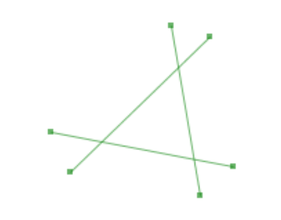 | 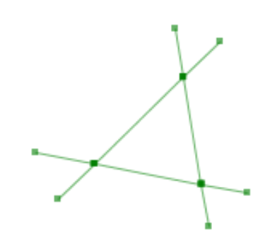 |
| :---: | :---: |
| ***Not noded (3 LineStrings)***  | ***Noded (9 LineStrings)*** |

**Figure 9-1 – Before and After Noding** 

A simple trick for noding a group of `LineStrings` is to union them together. It turns out  that the unioning 
process will node the `LineStrings` for us. For example, the following  code will node a collection of 
`LineStrings`: 

```java
Collection lineStrings = . . .   
Geometry nodedLineStrings = (LineString) lineStrings.get(0);  
for (int i = 1; i \< lineStrings.size(); i++) {   
 nodedLineStrings = nodedLineStrings.union((LineString)lineStrings.get(i));  
}
```


