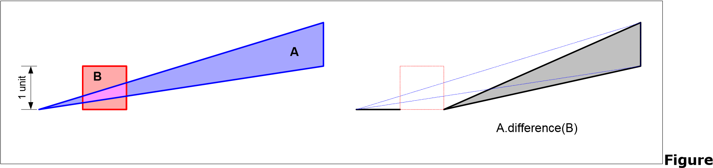
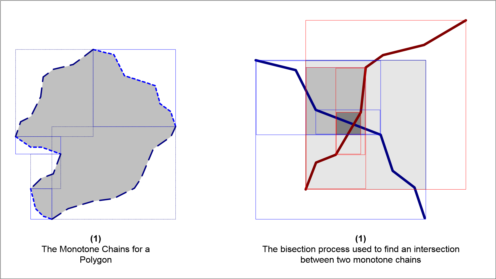
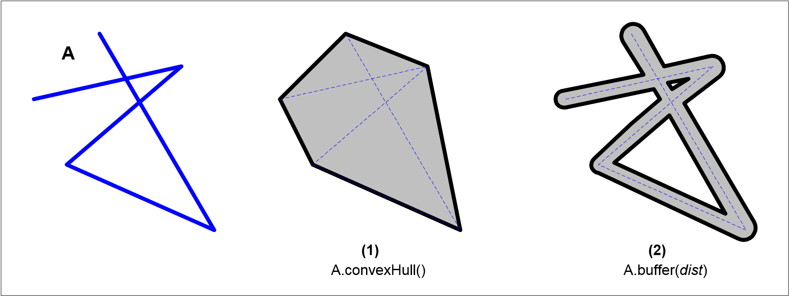
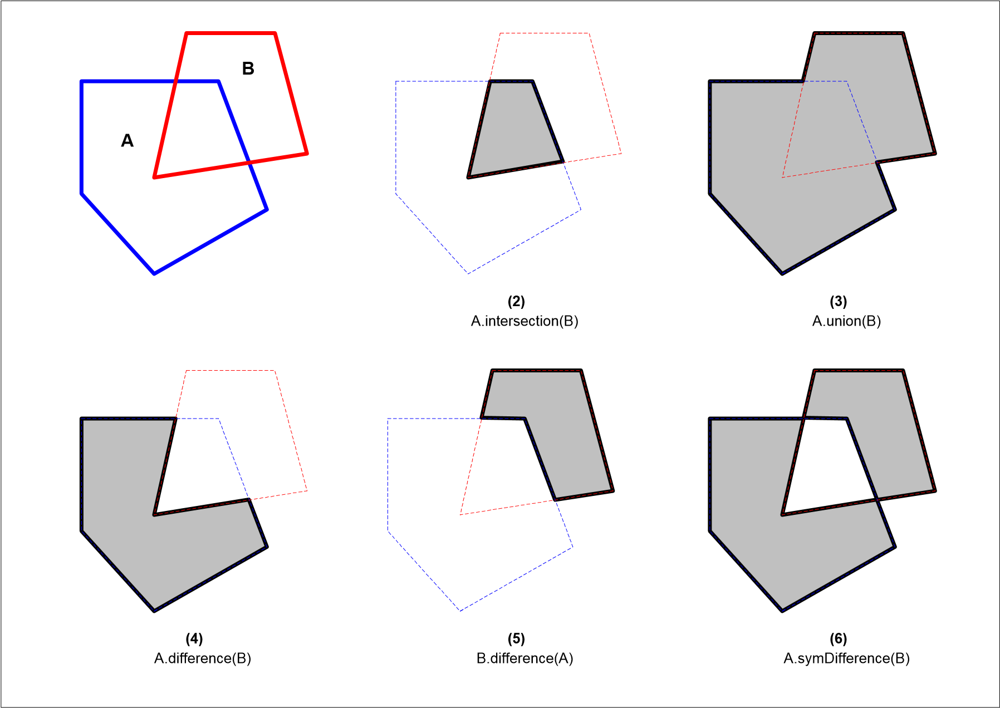
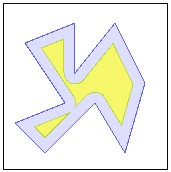
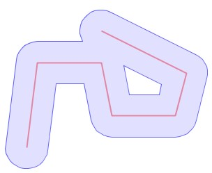
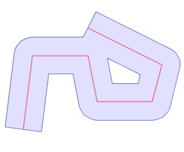

# Technical Specifications 

**Version 1.4**

**Document Change Control**

+------------+------------+-----------------+-------------------------------------+
| **REVISION | **DATE OF  | > **AUTHOR(S)** | **BRIEF DESCRIPTION OF CHANGE**     |
| NUMBER**   | ISSUE**    |                 |                                     |
+============+============+=================+=====================================+
| 1.3        | March 31,  | M. Davis        | Updated to cover changes in JTS 1.3 |
|            | 2003       |                 |                                     |
+------------+------------+-----------------+-------------------------------------+
| 1.4        | October    | J. Aquino       | CoordinateSequences and the         |
|            | 17, 2003   |                 | user-data field                     |
+------------+------------+-----------------+-------------------------------------+
| 1.4.1      |            | M Davis         | • Fixed definition of contains      |
+------------+------------+-----------------+-------------------------------------+

**Table of Contents**

1.  **OVERVIEW
    \...\...\...\...\...\...\...\...\...\...\...\...\...\...\...\...\...\...\...\...\...\...\...\...\...\...\.....7**

2.  **OTHER RESOURCES
    \...\...\...\...\...\...\...\...\...\...\...\...\...\...\...\...\...\...\...\...\...\...\...\...7**

3.  **DESIGN GOALS
    \...\...\...\...\...\...\...\...\...\...\...\...\...\...\...\...\...\...\...\...\...\...\...\...\...\...7**

4.  **TERMINOLOGY
    \...\...\...\...\...\...\...\...\...\...\...\...\...\...\...\...\...\...\...\...\...\...\...\...\...\...8**

5.  **NOTATION
    \...\...\...\...\...\...\...\...\...\...\...\...\...\...\...\...\...\...\...\...\...\...\...\...\...\...\.....8**

6.  **JAVA
    IMPLEMENTATION\...\...\...\...\...\...\...\...\...\...\...\...\...\...\...\...\...\...\...\...\...\....8**

7.  **COMPUTATIONAL GEOMETRY
    ISSUES\...\...\...\...\...\...\...\...\...\...\...\...\...\...\...\...\...9**

    1.  **PRECISION MODEL
        \...\...\...\...\...\...\...\...\...\...\...\...\...\...\...\...\...\...\...\...\...\...\...9**

        1.  **Fixed
            Precision\...\...\...\...\...\...\...\...\...\...\...\...\...\...\...\...\...\...\...\...\...\...9**

        2.  **Floating
            Precision\...\...\...\...\...\...\...\...\...\...\...\...\...\...\...\...\...\...\...\....
            10**

    2.  **CONSTRUCTED POINTS AND DIMENSIONAL COLLAPSE
        \...\...\...\...\...\...\...\... 10**

    3.  **ROBUSTNESS\...\...\...\...\...\...\...\...\...\...\...\...\...\...\...\...\...\...\...\...\...\...\...\.....
        11**

    4.  **NUMERICAL
        STABILITY\...\...\...\...\...\...\...\...\...\...\...\...\...\...\...\...\...\...\...\.....
        11**

    5.  **COMPUTATIONAL
        PERFORMANCE\...\...\...\...\...\...\...\...\...\...\...\...\...\...\...\....
        12**

        1.  **Monotone
            Chains\...\...\...\...\...\...\...\...\...\...\...\...\...\...\...\...\...\...\...\.....
            12**

8.  **SPATIAL
    MODEL\...\...\...\...\...\...\...\...\...\...\...\...\...\...\...\...\...\...\...\...\...\...\...\...\...
    13**

    1.  **DESIGN DECISIONS FOR SPATIAL MODELS
        \...\...\...\...\...\...\...\...\...\...\...\...\... 13**

    2.  **GEOMETRIC
        DEFINITIONS\...\...\...\...\...\...\...\...\...\...\...\...\...\...\...\...\...\...\.....
        14**

        1.  **Geometry\...\...\...\...\...\...\...\...\...\...\...\...\...\...\...\...\...\...\...\...\...\...\.....
            15**

        2.  **Empty
            Geometry\...\...\...\...\...\...\...\...\...\...\...\...\...\...\...\...\...\...\...\.....
            15**

        3.  **GeometryCollection\...\...\...\...\...\...\...\...\...\...\...\...\...\...\...\...\...\...\....
            15**

        4.  **Curve\...\...\...\...\...\...\...\...\...\...\...\...\...\...\...\...\...\...\...\...\...\...\...\...\....
            15**

        5.  **MultiCurve
            \...\...\...\...\...\...\...\...\...\...\...\...\...\...\...\...\...\...\...\...\...\...\...
            15**

        6.  **LineString
            \...\...\...\...\...\...\...\...\...\...\...\...\...\...\...\...\...\...\...\...\...\...\....
            16**

        7.  **LinearRing\...\...\...\...\...\...\...\...\...\...\...\...\...\...\...\...\...\...\...\...\...\...\....
            16**

        8.  **Polygon
            \...\...\...\...\...\...\...\...\...\...\...\...\...\...\...\...\...\...\...\...\...\...\...\....
            16**

        9.  **MultiPolygon\...\...\...\...\...\...\...\...\...\...\...\...\...\...\...\...\...\...\...\...\...\....
            18**

    3.  **SIMPLE FEATURE CLASSES
        \...\...\...\...\...\...\...\...\...\...\...\...\...\...\...\...\...\...\...
        18**

        1.  **Geometry\...\...\...\...\...\...\...\...\...\...\...\...\...\...\...\...\...\...\...\...\...\...\.....
            18**

        2.  **GeometryCollection\...\...\...\...\...\...\...\...\...\...\...\...\...\...\...\...\...\...\....
            18**

        3.  **Point
            \...\...\...\...\...\...\...\...\...\...\...\...\...\...\...\...\...\...\...\...\...\...\...\...\....
            18**

        4.  **MultiPoint
            \...\...\...\...\...\...\...\...\...\...\...\...\...\...\...\...\...\...\...\...\...\...\....
            18**

        5.  **Curve\...\...\...\...\...\...\...\...\...\...\...\...\...\...\...\...\...\...\...\...\...\...\...\...\....
            18**

        6.  **LineString
            \...\...\...\...\...\...\...\...\...\...\...\...\...\...\...\...\...\...\...\...\...\...\....
            18**

        7.  **Line\...\...\...\...\...\...\...\...\...\...\...\...\...\...\...\...\...\...\...\...\...\...\...\...\...\...
            18**

        8.  **LinearRing\...\...\...\...\...\...\...\...\...\...\...\...\...\...\...\...\...\...\...\...\...\...\....
            18**

        9.  **MultiCurve
            \...\...\...\...\...\...\...\...\...\...\...\...\...\...\...\...\...\...\...\...\...\...\...
            18**

> **8.3.10MultiLineString\...\...\...\...\...\...\...\...\...\...\...\...\...\...\...\...\...\...\...\...\...\...
> 18**
>
> **8.3.11Surface
> \...\...\...\...\...\...\...\...\...\...\...\...\...\...\...\...\...\...\...\...\...\...\...\...\...
> 18**
>
> **8.3.12Polygon\...\...\...\...\...\...\...\...\...\...\...\...\...\...\...\...\...\...\...\...\...\...\...\...\...
> 18**
>
> **8.3.13MultiSurface\...\...\...\...\...\...\...\...\...\...\...\...\...\...\...\...\...\...\...\...\...\...\...
> 19**
>
> **8.3.14MultiPolygon\...\...\...\...\...\...\...\...\...\...\...\...\...\...\...\...\...\...\...\...\...\...\...
> 19**

4.  **NORMAL FORM FOR
    GEOMETRY\...\...\...\...\...\...\...\...\...\...\...\...\...\...\...\...\...
    19**

5.  **SUPPORT
    CLASSES\...\...\...\...\...\...\...\...\...\...\...\...\...\...\...\...\...\...\...\...\...\....
    19**

    1.  **Coordinate
        \...\...\...\...\...\...\...\...\...\...\...\...\...\...\...\...\...\...\...\...\...\...\...
        19**

    2.  **CoordinateSequence\...\...\...\...\...\...\...\...\...\...\...\...\...\...\...\...\...\...\...
        20**

    3.  **Envelope\...\...\...\...\...\...\...\...\...\...\...\...\...\...\...\...\...\...\...\...\...\...\...\...
        20**

    4.  **IntersectionMatrix\...\...\...\...\...\...\...\...\...\...\...\...\...\...\...\...\...\...\...\...
        20**

    5.  **GeometryFactory\...\...\...\...\...\...\...\...\...\...\...\...\...\...\...\...\...\...\...\....
        20**

    6.  **CoordinateFilter
        \...\...\...\...\...\...\...\...\...\...\...\...\...\...\...\...\...\...\...\.....
        20**

    7.  **GeometryFilter\...\...\...\...\...\...\...\...\...\...\...\...\...\...\...\...\...\...\...\...\....
        20**

6.  **SPATIAL REFERENCE
    SYSTEM\...\...\...\...\...\...\...\...\...\...\...\...\...\...\...\...\...\...
    20**

<!-- -->

9.  **BASIC GEOMETRIC ALGORITHMS AND
    STRUCTURES\...\...\...\...\...\...\...\...\...\..... 21**

    1.  **POINT-LINE ORIENTATION
        TEST\...\...\...\...\...\...\...\...\...\...\...\...\...\...\...\...\...
        21**

    2.  **LINE INTERSECTION TEST
        \...\...\...\...\...\...\...\...\...\...\...\...\...\...\...\...\...\...\....
        21**

    3.  **LINE INTERSECTION COMPUTATION
        \...\...\...\...\...\...\...\...\...\...\...\...\...\...\....
        21**

    4.  **POINT-IN-RING
        TEST\...\...\...\...\...\...\...\...\...\...\...\...\...\...\...\...\...\...\...\...\.....
        22**

    5.  **RING ORIENTATION
        TEST\...\...\...\...\...\...\...\...\...\...\...\...\...\...\...\...\...\...\.....
        22**

10. **TOPOLOGICAL COMPUTATION
    \...\...\...\...\...\...\...\...\...\...\...\...\...\...\...\...\...\...\...
    22**

    1.  **TOPOLOGY GRAPHS
        \...\...\...\...\...\...\...\...\...\...\...\...\...\...\...\...\...\...\...\...\...
        22**

    2.  **LABELS\...\...\...\...\...\...\...\...\...\...\...\...\...\...\...\...\...\...\...\...\...\...\...\...\...\....
        22**

    3.  **COMPUTING THE INTERSECTION MATRIX FROM A
        LABELING\...\...\...\...\... 23**

    4.  **THE RELATE
        ALGORITHM\...\...\...\...\...\...\...\...\...\...\...\...\...\...\...\...\...\...\...
        24**

> **10.4.1Labeling isolated components
> \...\...\...\...\...\...\...\...\...\...\...\...\...\...\..... 24**

5.  **THE OVERLAY
    ALGORITHM\...\...\...\...\...\...\...\...\...\...\...\...\...\...\...\...\...\....
    24**

<!-- -->

11. **BINARY PREDICATES
    \...\...\...\...\...\...\...\...\...\...\...\...\...\...\...\...\...\...\...\...\...\...\...
    25**

    1.  **GENERAL DISCUSSION
        \...\...\...\...\...\...\...\...\...\...\...\...\...\...\...\...\...\...\...\....
        25**

    2.  **METHOD
        SPECIFICATIONS\...\...\...\...\...\...\...\...\...\...\...\...\...\...\...\...\...\...\...
        26**

> **11.2.1Equals\...\...\...\...\...\...\...\...\...\...\...\...\...\...\...\...\...\...\...\...\...\...\...\...\.....
> 26**
>
> **11.2.2Disjoint\...\...\...\...\...\...\...\...\...\...\...\...\...\...\...\...\...\...\...\...\...\...\...\...\...
> 26**
>
> **11.2.3Intersects
> \...\...\...\...\...\...\...\...\...\...\...\...\...\...\...\...\...\...\...\...\...\...\...\...
> 26**
>
> **11.2.4Touches
> \...\...\...\...\...\...\...\...\...\...\...\...\...\...\...\...\...\...\...\...\...\...\...\.....
> 26**
>
> **11.2.5Crosses
> \...\...\...\...\...\...\...\...\...\...\...\...\...\...\...\...\...\...\...\...\...\...\...\...\...
> 27**
>
> **11.2.6Within
> \...\...\...\...\...\...\...\...\...\...\...\...\...\...\...\...\...\...\...\...\...\...\...\...\....
> 27**
>
> **11.2.7Contains\...\...\...\...\...\...\...\...\...\...\...\...\...\...\...\...\...\...\...\...\...\...\...\.....
> 27**
>
> **11.2.8Overlaps\...\...\...\...\...\...\...\...\...\...\...\...\...\...\...\...\...\...\...\...\...\...\...\.....
> 27**

12. **SPATIAL ANALYSIS
    METHODS\...\...\...\...\...\...\...\...\...\...\...\...\...\...\...\...\...\...\.....
    27**

    1.  **GENERAL DISCUSSION
        \...\...\...\...\...\...\...\...\...\...\...\...\...\...\...\...\...\...\...\....
        27**

**1.1.1** **Representation of Computed Geometries
\...\...\...\...\...\...\...\...\...\.... 27**

2.  **CONSTRUCTIVE METHODS
    \...\...\...\...\...\...\...\...\...\...\...\...\...\...\...\...\...\.....
    28**

3.  **SET-THEORETIC METHODS
    \...\...\...\...\...\...\...\...\...\...\...\...\...\...\...\...\...\....
    28**

4.  **METHOD
    SPECIFICATIONS\...\...\...\...\...\...\...\...\...\...\...\...\...\...\...\...\...\...\...
    29**

> **12.4.1Buffer\...\...\...\...\...\...\...\...\...\...\...\...\...\...\...\...\...\...\...\...\...\...\...\...\.....
> 29**
>
> **12.4.2ConvexHull
> \...\...\...\...\...\...\...\...\...\...\...\...\...\...\...\...\...\...\...\...\...\...\....
> 31**
>
> **12.4.3Intersection
> \...\...\...\...\...\...\...\...\...\...\...\...\...\...\...\...\...\...\...\...\...\...\...
> 31**
>
> **12.4.4Union
> \...\...\...\...\...\...\...\...\...\...\...\...\...\...\...\...\...\...\...\...\...\...\...\...\.....
> 31**
>
> **12.4.5Difference
> \...\...\...\...\...\...\...\...\...\...\...\...\...\...\...\...\...\...\...\...\...\...\.....
> 31**
>
> **12.4.6SymDifference
> \...\...\...\...\...\...\...\...\...\...\...\...\...\...\...\...\...\...\...\...\...\...
> 31**

13. **OTHER METHODS
    \...\...\...\...\...\...\...\...\...\...\...\...\...\...\...\...\...\...\...\...\...\...\...\....
    31**

> **13.1.1Boundary\...\...\...\...\...\...\...\...\...\...\...\...\...\...\...\...\...\...\...\...\...\...\...\....
> 31**
>
> **13.1.2IsClosed
> \...\...\...\...\...\...\...\...\...\...\...\...\...\...\...\...\...\...\...\...\...\...\...\.....
> 32**
>
> **13.1.3IsSimple
> \...\...\...\...\...\...\...\...\...\...\...\...\...\...\...\...\...\...\...\...\...\...\...\.....
> 32**
>
> **13.1.4IsValid
> \...\...\...\...\...\...\...\...\...\...\...\...\...\...\...\...\...\...\...\...\...\...\...\...\....
> 33**

14. **WELL-KNOWN TEXT
    INPUT/OUTPUT\...\...\...\...\...\...\...\...\...\...\...\...\...\...\...\.....
    33**

    1.  **WELL-KNOWN TEXT
        SYNTAX\...\...\...\...\...\...\...\...\...\...\...\...\...\...\...\...\.....
        34**

    2.  **WELL-KNOWN TEXT
        READER\...\...\...\...\...\...\...\...\...\...\...\...\...\...\...\...\.....
        35**

    3.  **WELL-KNOWN TEXT
        WRITER\...\...\...\...\...\...\...\...\...\...\...\...\...\...\...\...\.....
        35**

15. **REFERENCES\...\...\...\...\...\...\...\...\...\...\...\...\...\...\...\...\...\...\...\...\...\...\...\...\...\....
    36**

## 1. OVERVIEW 

The JTS Topology Suite is a Java API that implements a core set of
spatial data operations using an explicit precision model and robust
geometric algorithms. JTS is intended to be used in the development of
applications that support the validation, cleaning, integration and
querying of spatial datasets. This document is the design specification
for the classes, methods and algorithms implemented in the JTS Topology
Suite.

JTS attempts to implement the OpenGIS Simple Features Specification
(SFS) as accurately as possible. In some cases the SFS is unclear or
omits a specification; in this case JTS attempts to choose a reasonable
and consistent alternative. Differences from and elaborations of the SFS
are documented in this specification.

The detailed documentation of the class hierarchy and methods will be
presented in the form of JavaDoc for the source code.

## 2. OTHER RESOURCES 

• *OpenGIS Simple Features Specification For SQL Revision 1.1* (referred
to as SFS in this document). This document provides the master
specification for the spatial data model and the definitions of the
spatial predicates and functions implemented by JTS.

## 3. DESIGN GOALS 

The design of JTS is intended to fulfil the following goals:

- The spatial model and method definitions will conform to the OpenGIS
  Simple Features Specification as accurately as possible, consistent
  with correct implementation.

- The API design will follow Java conventions wherever possible. For
  instance:

> accessor functions will use the Java getX and setX convention
> predicates will use the isX convention methods will start with a
> lowercase letter

- JTS functions will support a user-defined precision model. JTS
  algorithms will be robust under that precision model.

- Methods will return topologically and geometrically correct results
  within the defined precision model wherever possible.

- Correctness is the highest priority; space and time efficiency is
  important but secondary.

- JTS will be fast enough to be used in a production environment.

- The algorithms and code used in JTS will be clear and well-structured,
  to facilitate understanding by other developers.

## 4. TERMINOLOGY 

+-----------------------+----------------------------------------------+
| **Term**              | > **Definition**                             |
+=======================+==============================================+
| **Coordinate**        | > A point in space which is exactly          |
|                       | > representable under the defined precision  |
|                       | > model                                      |
+-----------------------+----------------------------------------------+
| **Exact Computation** | > Numerical computation which maintains all  |
|                       | > digits of numbers through all operations.  |
|                       | > Usually requires computionally expensive   |
|                       | > algorithms                                 |
+-----------------------+----------------------------------------------+
| **Node**              | > A point where two lines within the same or |
|                       | > different geometries intersect. This point |
|                       | > is not necessarily representable by a      |
|                       | > coordinate, since the output of the        |
|                       | > computation of the intersection point in   |
|                       | > general requires greater precision than    |
|                       | > the input points.                          |
+-----------------------+----------------------------------------------+
| **Noding (also        | > The process of computing the nodes where   |
| Noded)**              | > one or more geometries intersect.          |
+-----------------------+----------------------------------------------+
| **Non-coordinate**    | > A point which is not representable as a    |
|                       | > coordinate                                 |
+-----------------------+----------------------------------------------+
| **Numerical           | > The stability of an numerical algorithm is |
| Stability**           | > determined by the maximum bound on the     |
|                       | > error in its outputs. An algorithm is      |
|                       | > considered to be stable if this bound is   |
|                       | > small.                                     |
+-----------------------+----------------------------------------------+
| **Point**             | > An arbitrary point in R^3^. In general,    |
|                       | > not finitely representable.                |
+-----------------------+----------------------------------------------+
| **Proper              | > An intersection between two line segments  |
| intersection**        | > where the intersection is a single point   |
|                       | > and is internal to both segments           |
+-----------------------+----------------------------------------------+
| **Robust              | > Numerical computation which is guaranteed  |
| Computation**         | > to return the correct answer for all       |
|                       | > inputs. Usually requires algorithms which  |
|                       | > are specially designed to handle round-off |
|                       | > error.                                     |
+-----------------------+----------------------------------------------+
| **SFS**               | > OGC Simple Features Specification          |
+-----------------------+----------------------------------------------+
| **Unit of             | > The smallest representable distance under  |
| Resolution**          | > the defined precision model.               |
+-----------------------+----------------------------------------------+
| **Vertex (pl.         | > A "corner point" of a geometric object.    |
| vertices)**           | > These are the coordinates explicitly       |
|                       | > stored to locate a geometric object.       |
+-----------------------+----------------------------------------------+

## 5. NOTATION 

- Items in the specification which adhere to the SFS are indicated by
  referring to the relevant section in the SFS in parentheses: (SFS 1.0)

- Items in the specification which elaborate on or differ from the SFS
  will be indicated by the term "JTS" in parentheses: (JTS)

## 6. JAVA IMPLEMENTATION 

Java coding style is in some cases different to the coding style used in
the SFS. Where the two are different in general JTS follows Java
conventions. JTS coding style differs from SFS coding style in the
following ways:

- the SFS sometimes uses Integer to represent a boolean value. JTS will
  use a boolean in this case

- method names in the SFS start with an uppercase letter. In JTS all
  method names start with a lowercase letter

- method names in JTS sometimes have the prefix "get" or "set" added to
  them, to conform to the conventions for Java Beans.

## 7. COMPUTATIONAL GEOMETRY ISSUES 

### 7.1 PRECISION MODEL 

All numerical computation takes place under some form of precision
model. There are several possible types of precision model:

  --------------------------------------------------------------------------
  **Fixed**      Coordinates are represented as points on a grid with
                 uniform spacing. Computed coordinates are rounded to this
                 grid.
  -------------- -----------------------------------------------------------
  **Floating**   Coordinates are represented as floating-point numbers.
                 Computed coordinates may have more digits of precision than
                 the input values (up the maximum allowed by the finite
                 floating-point representation).

  **Exact**      Coordinates are represented exactly (often as rational
                 numbers with integral numerator and denominator).
                 Implementing this model carries a penalty in space and time
                 performance, which is often considered unacceptable.
  --------------------------------------------------------------------------

Often the precision model of a computation is not stated explicitly, but
is implied by the model used for representing the values (such as
floating point or integer). A limitation in this approach is that the
user is unable to work in a precision model with lower precision. It is
often the case that computed results are of higher precision than the
inputs. The higher precision values may not be acceptable either for
further computation or for storage in a format with the original (or
lower) precision.

JTS deals with this problem by allowing the user to specify an explicit
precision model. The precision model allows the client to state how many
bits of precision are to be assumed in the input coordinate values, and
maintained in any computed coordinates.

In JTS methods input Geometries may have different precision models. In
the case of methods which return Geometrys, the precision model of the
returned result is the maximum of the two input precision models (i.e.
the one with largest precision). Note that this only works if the two
precision models are compatible. Two precision models are compatible if
the scale factor of one is an integer multiple of the scale factor of
the other. No attempt is made to reconcile incompatible precision
models.

JTS supports two basic types of precision model: Fixed and Floating.

#### 7.1.1 Fixed Precision 

In the Fixed precision model, coordinates are assumed to fall exactly on
the intersections of a discrete grid. The size of the grid is determined
by a scale factor. The grid size is the inverse of the scale factor. The
scale factor can also be thought of as determining how many decimal
places of precision are maintained. The scale factor may be either
greater or less than 1, depending on whether the "precision point" is to
the right or left of the decimal point.

Coordinates are made precise according to the following equations:

jtsPt.x = round( inputPt.x \* scale ) / scale jtsPt.y = round( inputPt.y
\* scale ) / scale

Precise coordinates will be represented internally as double-precision
values. This is known as the "precise internal representation". Since
Java uses the IEEE-754 floating point standard, this provides 53 bits of
precision. (Thus the maximum precisely representable value is
9,007,199,254,740,992).

Input routines are responsible for rounding coordinates to the precision
model before creating JTS structures. (The input routines supplied with
JTS will perform this rounding automatically.)

#### 7.1.2 Floating Precision 

There are two types of Floating precision model supported, double and
single precision. Both of these are based on the Java floating point
model, which in turn is based on the IEEE-754 floating point standard.
This provides approximately 16 digits of precision for double precision
and 6 digits of precision for single precision.

In the Floating Double Precision Model, coordinates can have the full
precision available with Java double-precision floating point numbers.
Input coordinates are not assumed to be rounded off, and internal
operations which compute constructed points do not round off the
computed coordinates. Note that this does not mean that constructed
points are exact; they are still limited to the precision of
double-precision numbers, and hence may still be only an approximation
to the exact point.

In the Floating Single Precision Model, computed coordinates are rounded
to single precision. This supports situations where the eventual
destination of computed geometry is a single-precision format (e.g. such
as Java2D).

### 7.2 CONSTRUCTED POINTS AND DIMENSIONAL COLLAPSE 

Geometries computed by spatial analysis methods may contain constructed
points which are not present in the input Geometries. These new points
arise from intersections between line segments in the edges of the input
Geometries. In the general case it is not possible to represent
constructed points exactly. This is due to the fact that the coordinates
of an intersection point may contain as much as twice as many bits of
precision as the coordinates of the input line segments. In order to
represent these constructed points explicitly, JTS must round them to
fit the given Precision Model.

Unfortunately, rounding coordinates moves them slightly. Line segments
which would not be coincident in the exact result may become coincident
in the truncated representation. For Line-Line combinations, this can
produce result Geometries containing points which were not in the
interior of the input Geometries. More seriously, for Line-Area
combinations, this can lead to *dimensional collapses*, which are
situations where a computed component has a lower dimension than it
would in the exact result.

> {width="6.4366666666666665in"
> height="1.5233333333333334in"}
>
> **1 - An example of dimensional collapse**

JTS handles dimensional collapses as gracefully as possible, by forming
the lower-dimension Geometry resulting from the collapse. For instance,
an Area-Area intersection with a dimensional collapse would return a
Line or Point Geometry as a component of the result.

### 7.3 ROBUSTNESS 

Geometric algorithms involve a combination of combinatorial and
numerical computation. As with all numerical computation using
finite-precision numbers, the algorithms chosen are susceptible to
problems of robustness. A robustness problem occurs when a numerical
calculation produces an inexact answer due to round-off errors.
Robustness problems are especially serious in geometric computation,
since the numerical errors can propagate into the combinatorial
computations and result in complete failure of the algorithm. (See
\[Bri98\], \[Sch91\].)

There are many approaches to dealing with the problem of robustness in
geometric computation. Not surprisingly, most robust algorithms are
substantially more complex and less performant than the non-robust
versions. JTS attempts to deal with the problem of robustness in two
ways:

- The important fundamental geometric algorithms (such as Line
  Orientation, Line Intersection and the Point-In-Polygon test) have
  been implemented using robust algorithms. In particular, the
  implementation of several algorithms relies on the robust determinant
  evaluation presented in \[Ava97\]).

- The algorithms used to implement the SFS predicates and functions have
  been developed to eliminate or minimize robustness problems. The
  binary predicate algorithm is completely robust. The spatial overlay
  and buffer algorithms are nonrobust, but will return correct answers
  in the majority of cases.

### 7.4 NUMERICAL STABILITY 

A desirable feature of numerical algorithms is that they exhibit
***stability***. The stability of a numerical algorithm is determined by
the bound on the maximum error in its outputs. An algorithm is
considered to be stable if this bound is small.

The primary numerical algorithm used in JTS is the computation of the
intersection point between two segments. This algorithm is inherently
inexact, since the bits of precision required to represent the
intersection point is several times greater than the precision of the
inputs. A stable algorithm for this computation will always produce
approximate answers that are close to the exact answer. In particular,
the computed points should at least lie within the bounding box of the
input line segments! Ideally, the computed points will lie within a
single precision model grid unit of the exact answer.

One way to increase the stability of numerical algorithms is to
***condition*** their inputs.

Conditioning inputs involves numerically manipulating them in some way
that produces the same answer while preserving more precision during the
calculations. JTS uses a technique of "normalizing" the input line
segments to the line intersection computation. Normalized line segments
have been translated to be as close to the origin as possible. This has
the effect of removing common significant digits from each ordinate, and
thus increases the bits of precision available to maintain the accuracy
of the line intersection computation.

### 7.5 COMPUTATIONAL PERFORMANCE 

Runtime performance is an important consideration for a
production-quality implementation of geometric algorithms. The most
computationally intensive algorithm used in JTS is intersection
detection. Many JTS methods need to determine both all intersection
between the line segments in a single Geometry (self-intersection) and
all intersections between the line segments of two different Geometries.

The obvious algorithm for intersection detection, that of comparing
every segment with every other, has unacceptably slow performance. There
is a large literature of efficient algorithms for intersection
detection. Unfortunately, many of them involve substantial code
complexity. JTS tries to balance code simplicity with performance gains.
It uses some special techniques to produce substantial performance gains
for common types of input data. These techniques include in-memory
spatial indexes of various types, and sophisticated methods for
structuring data such as the technique of Monotone Chains.

#### 7.5.1 Monotone Chains 

JTS uses the technique of "Monotone Chains" to obtain substantial
performance improvements with minimal additional code complexity. This
technique involves dividing edges into monotone chains of segments. A
monotone chain consists of a sequence of segments whose direction
vectors all lie in the same quadrant. Monotone chains have two important
properties:

**Non-Intersection Property**: the segments within a monotone chain do
not intersect.

**Endpoint Envelope Property**: the envelope of any contiguous subset of
the segments in a monotone chain is the envelope of the endpoints of the
subset.

The Non-Intersection Property means that there is no need to test pairs
of segments from within the same monotone chain for intersection. The
Endpoint Envelope Property allows binary search to be used to find the
intersection points along a monotone chain. In addition, the larger
bounding boxes of monotone chains relative to individual segments act as
a form of "clustering" of segments, which reduces the overall number of
intersection tests required.

For data with a significant percentage of monotone chains, these
properties eliminate a large number of segment comparisons. Monotone
chains are common in data that has been generated by stream digitizing
along natural features. Performance improvements of up to 100 times over
the naive algorithm have been observed.

> {width="5.986666666666666in" height="3.38in"}
>
> **Figure 2 - Monotone Chains**

## 8. SPATIAL MODEL 

### 8.1 DESIGN DECISIONS FOR SPATIAL MODELS 

The SFS is just one of several spatial models in use in existing spatial
databases and APIs.

These models are for the most part quite similar. Generally, they all
support representing 2-dimensional points, lines and polygons. There are
some subtle differences between the ways Geometrys are represented,
however. These differences represent design decisions made by the
designers of the spatial API. Some important design choices are listed
below (in each case, the choice made in the SFS and JTS is indicated).

+----------------+-------------------------------------------------------+
| ***Design      | > **Repeated Points allowed in Geometries**           |
| Decision***    |                                                       |
+================+=======================================================+
| ***SFS         | > Repeated Points are allowed                         |
| Choice***      |                                                       |
+----------------+-------------------------------------------------------+
| ***JTS         | > Same as SFS                                         |
| Choice***      |                                                       |
+----------------+-------------------------------------------------------+
| ***Comments*** | > In general spatial algorithms are not tolerant of   |
|                | > repeated points. Allowing repeated points causes a  |
|                | > performance and space penalty, since every spatial  |
|                | > method must check for repeated points and remove    |
|                | > them. JTS does support repeated points, since not   |
|                | > doing so is a major point of incompatibility with   |
|                | > the OGC model. However, there is a small memory and |
|                | > performance cost to doing so.                       |
+----------------+-------------------------------------------------------+

+----------------+-------------------------------------------------------+
| ***Design      | > **Linestrings allowed to self-intersect (i.e. can   |
| Decision***    | > be non-simple)**                                    |
+================+=======================================================+
| ***SFS         | > Linestrings are allowed to self-intersect           |
| Choice***      |                                                       |
+----------------+-------------------------------------------------------+
| ***JTS         | > Same as SFS                                         |
| Choice***      |                                                       |
+----------------+-------------------------------------------------------+
| ***Comments*** | > Allowing non-simple linestrings exacts a small      |
|                | > performance penalty, since it means that            |
|                | > linestrings must be noded before being used in      |
|                | > spatial methods. However, it is desirable to be     |
|                | > able to represent nonsimple linestrings, so if the  |
|                | > LineString class itself is defined to be simple,    |
|                | > another class must be introduced to represent       |
|                | > non-simple lines                                    |
|                | >                                                     |
|                | > (sometimes referred to as "Spaghetti").             |
+----------------+-------------------------------------------------------+

+----------------+-------------------------------------------------------+
| ***Design      | > **Polygon rings can self-touch at single points.**  |
| Decision***    |                                                       |
+================+=======================================================+
| ***SFS         | > Polygon rings can NOT self-touch at single points   |
| Choice***      |                                                       |
+----------------+-------------------------------------------------------+
| ***JTS         | > Same as SFS                                         |
| Choice***      |                                                       |
+----------------+-------------------------------------------------------+
| ***Comments*** | > This decision arises from the need to support       |
|                | > representing polygons containing holes which touch  |
|                | > the shell at a single point ("inverted" polygons).  |
|                | > It also covers the case of representing a single    |
|                | > hole which contains an exterior area which is       |
|                | > disconnected (an "exverted" hole). In order to      |
|                | > represent inverted polygons and exverted holes,     |
|                | > either polygon rings must be allowed to self-touch  |
|                | > at a single point OR rings must be allowed to       |
|                | > mutually touch at single points.                    |
|                | >                                                     |
|                | > This design decision is a sense the dual of the     |
|                | > choice of whether polygon rings can mutually touch  |
|                | > at single points                                    |
|                | >                                                     |
|                | > Unfortunately, making the choice that polygon rings |
|                | > can NOT selftouch results in slightly more complex  |
|                | > algorithms, since the usual polygon-building        |
|                | > algorithm results in shells which self-touch. It is |
|                | > necessary to perform a further step to convert the  |
|                | > boundaries of the areas isolated by the self-touch  |
|                | > into a hole.                                        |
+----------------+-------------------------------------------------------+

+----------------+-------------------------------------------------------+
| ***Design      | > **Polygon rings can mutually touch at single        |
| Decision***    | > points**                                            |
+================+=======================================================+
| ***SFS         | > Polygon rings can mutually touch at single points   |
| Choice***      |                                                       |
+----------------+-------------------------------------------------------+
| ***JTS         | > Same as SFS                                         |
| Choice***      |                                                       |
+----------------+-------------------------------------------------------+
| ***Comments*** | > This design decision is the dual of the decision    |
|                | > about whether polygon rings can self-touch at       |
|                | > single points.                                      |
+----------------+-------------------------------------------------------+

In most cases these design choices are of no consequence to the users of
the API, since they do not change the set of Geometrys that can be
represented. However, they do have implications for the performance and
complexity of the algorithms implemented in the API. Also, it is
generally non-trivial to convert between the representations of two APIs
that have made different design choices (in particular, if two APIs make
different choices for whether polygon rings can self-touch, some
relatively complex processing is necessary to convert the polygonal
representations).

### 8.2 GEOMETRIC DEFINITIONS 

All JTS methods assume that their arguments are valid Geometric objects,
according to the definitions given in the SFS.

The following definitions elaborate or clarify the definitions given in
the SFS.

#### 8.2.1 Geometry 

A Precision Model object will be a member of every Geometry object.

According to the SFS Geometry objects can represent only closed sets.
This is a reasonable decision which allows for practical implementation.
However, there are some implications for the semantics of the spatial
analysis methods (see *Section 12 Spatial Analysis Methods*).

JTS has a simple scheme for adding attributes to a Geometry:
applications may set a Geometry's *user data* field to any object.

#### 8.2.2 Empty Geometry 

The SFS specifies that objects of each Geometry subclass may be empty.
It is sometimes necessary to construct an generic empty object of class
Geometry (e.g. if the exact type of the Geometry to be returned is not
known). The SFS does not define an specific class or object to represent
this generic empty Geometry. JTS uses the convention that an empty
GeometryCollection will be returned.

#### 8.2.3 GeometryCollection 

The dimension of a heterogeneous GeometryCollection is the maximum
dimension of its elements.

#### 8.2.4 Curve 

Curves may not be degenerate. That is, non-empty Curves must have at
least 2 points, and no two consecutive points may be equal.

#### 8.2.5 MultiCurve 

The SFS specifies using a "Mod-2" rule for determining the boundary of a
MultiCurve. A point is on the boundary of the MultiCurve iff it is on
the boundary of an odd number of elements of the MultiCurve. It should
be noted that this leads to cases where the set of points in the SFS
boundary is larger than either intuition or point-set topology would
indicate. That is, a point with an odd number \> 1 of edges incident on
it is on the boundary according to the SFS rule, but might not
intuitively be considered as part of the boundary. This also is
inconsistent with the topological definition of boundary, which is "the
set of points which are not contained in any open subset of the set of
points in the Geometry". For example, in Figure 3 (3), the point B is in
the boundary according to SFS, but is an interior point according to
point-set topology.

**(1)**

**(2)**

**(3)**

**(4)**

Boundary = { A, B }

**A**

**A**

**A**

**A**

**C**

**C**

**C**

**B**

**B**

**B**

**B**

**D**

**D**

**E**

Boundary = { A, C }

Boundary = { A, B, C, D }

Boundary = { A, C, D, E }

> **Figure 3 - Effect of the Mod-2 rule in MultiLineStrings**

Additional logic is required in JTS to implement the Mod-2 rule.

#### 8.2.6 LineString 

We are using the definition of LineString given in the OGC SFS. This
differs in an important way from some other spatial models (e.g. the one
use by ESRI ArcSDE). The difference is that LineStrings may be
non-simple. They may self-intersect in points or line segments.

In fact boundary points of a curve (e.g. the endpoints) may intersect
the interior of the curve, resulting in a curve that is technically
topologically closed but not closed according to the SFS. In this case
topologically the point of intersection would not be on the boundary of
the curve. However, according to the SFS definition the point is
considered to be on the boundary. JTS follows the SFS definition.

**A**

**B**

LineString: Boundary = { A, B }

*B is a boundary point, not an*

*interior po*

*[i]{.underline}*

*nt*

> **Figure 4 - A LineString with a boundary point intersecting an
> interior point**

#### 8.2.7 LinearRing 

LinearRings are the fundamental building block for Polygons. LinearRings
may not be degenerate; that is, a LinearRing must have at least 3
points. Other non-degeneracy criteria are implied by the requirement
that LinearRings be simple. For instance, not all the points may be
collinear, and the ring may not self-intersect. The SFS does not specify
a requirement on the orientation of a LinearRing. JTS follows this by
allowing LinearRings to be oriented either clockwise or
counter-clockwise.

#### 8.2.8 Polygon 

The shell and holes of a Polygon are LinearRings. The SFS definition of
Polygon has the following implications:

- The shell and holes cannot self-intersect (this is implied by the fact
  that they are LinearRings)

- Holes can touch the shell or another hole at a single point only. This
  means that holes cannot intersect one another at multiple points or in
  a line segment.

- Polygon interiors must be connected (This is implied by the previous
  statement).

- There is no requirement that a point where a hole touches the shell be
  a vertex.

Note that the SFS definition of Polygon differs from that in some other
commonly used spatial models. For instance, the ESRI ArcSDE spatial
model allows shells to self-intersect at vertices, but does not allow
holes to touch the shell. The SFS and the ArcSDE model are equivalent in
the sense that they describe exactly the same set of areas. However,
they may require different polygon structures to describe the same area.

*[e]{.underline}*

*This hole touches*

*[th]{.underline}*

*s*

*~~h~~*

*~~ell~~*

*at a*

*non-vertex*

*This hole tou*

*[c]{.underline}*

*~~e~~*

*~~s~~*

*the*

*[h]{.underline}*

*shell at a vertex*

A Polygon with 4 holes

> **Figure 5 - An example of a Polygon containing holes**

**(3)**

Hole touches shell in

line segment

**(4)**

The polygon interior is

disconnected

**(2)**

Hole touches shell at

more than one point

**(1)**

Hole crosses shell

**(7)**

Shell self-intersects

**(6)**

Holes touch in line

segment

**(5)**

Holes cross

> **Figure 6 - Examples of objects not representable as polygons**

Empty Polygons may not contain holes.

Since the shell and holes of Polygons are LinearRings, there is no
requirement on their orientation. They may be oriented either clockwise
or counterclockwise.

#### 8.2.9 MultiPolygon 

The element Polygons in a MultiPolygon may touch at only a finite number
of points (e.g. they may not touch in a line segment). The interiors of
the elements must be disjoint (e.g. they may not cross). There is no
requirement that a point of intersection be a vertex.

### 8.3 SIMPLE FEATURE CLASSES 

All Geometry classes allow empty objects to be created, and support the
isEmpty method. Empty Geometries will be represented by their internal
arrays having zero length.

All Geometry classes support the equalsExact() method, which returns
true if two Geometry subclasses are equivalent and have identical
sequence(s) of coordinates. Two objects are "equivalent" if their
classes are identical. The only exception is LinearRing and LineString,
which JTS considers to be equivalent.

All Geometry classes support the clone() method, which will return a
deep copy of the object.

8.3.1 Geometry

Geometry is non-instantiable and is implemented as an abstract class.

8.3.2 GeometryCollection

A GeometryCollection is implemented as an array of Geometry objects.

8.3.3 Point

A Point is implemented as a single Coordinate.

8.3.4 MultiPoint

A MultiPoint inherits the implementation of GeometryCollection, but
contains only Points.

8.3.5 Curve

Curve is non-instantiable and is implemented as an interface.

8.3.6 LineString

A LineString is implemented as an array of coordinates.

8.3.7 Line

JTS does not implement the Line class, since LineString offers
equivalent functionality.

#### 8.3.8 LinearRing 

A LinearRing containing n coordinates is implemented with an array of
Coordinates containing n+1 points, and coord\[0\] = coord\[n\].

8.3.9 MultiCurve

MultiCurve is non-instantiable and is implemented as an interface.

#### 8.3.10 MultiLineString 

A MultiLineString inherits the implementation of GeometryCollection, but
contains only LineStrings.

8.3.11 Surface

Surface is non-instantiable and is implemented as an interface.

#### 8.3.12 Polygon 

A Polygon is implemented as a single LinearRing for the outer shell, and
an array of

LinearRings for the holes. The outer shell is oriented CW and the holes
are oriented CCW.

8.3.13 MultiSurface

MultiSurface is non-instantiable and is implemented as an interface.

#### 8.3.14 MultiPolygon 

A MultiPolygon inherits the implementation of GeometryCollection, but
contains only Polygons.

### 8.4 NORMAL FORM FOR GEOMETRY 

JTS defines a normal (or canonical) form for representing
[Geometry]{.underline}s. Normal form is a unique representation for
[Geometry]{.underline}s. It can be used to test whether two Geometries
are equal in a way that is independent of the ordering of the
coordinates within them. Normal form equality is a stronger condition
than topological equality, but weaker than pointwise equality.

The definitions for normal form use the standard lexicographical
ordering for coordinates. "Sorted in order of coordinates" means the
obvious extension of this ordering to sequences of coordinates.

+---------------------+------------------------------------------------+
| **Geometry Class**  | **Definition of normal form**                  |
+=====================+================================================+
| Point               | Points are always in normal form               |
+---------------------+------------------------------------------------+
| MultiPoint          | Element Points are sorted in order of their    |
|                     | coordinates                                    |
+---------------------+------------------------------------------------+
| LineString          | Obeys the following condition:                 |
|                     |                                                |
|                     | > If there is an i such that coord\[i\] !=     |
|                     | > coord \[n -- i -- 1\] then coord \[i\] \<    |
|                     | > coord \[n -- i --1\]                         |
+---------------------+------------------------------------------------+
| LinearRing          | same as LineString                             |
+---------------------+------------------------------------------------+
| MultiLineString     | Element LineStrings are in normal form, and    |
|                     | are sorted in order of their coordinates       |
+---------------------+------------------------------------------------+
| Polygon             | The LinearRings of the Polygon are ordered     |
|                     | such that the smallest point is first. The     |
|                     | shell is ordered clockwise, and holes are      |
|                     | ordered counterclockwise. Holes are sorted in  |
|                     | order of their coordinates                     |
+---------------------+------------------------------------------------+
| MultiPolygon        | Element Polygons are in normal form, and are   |
|                     | sorted in order of their coordinates           |
+---------------------+------------------------------------------------+
| GeometryCollection  | Element [Geometry]{.underline}s are in normal  |
|                     | form.                                          |
|                     |                                                |
|                     | The list of elements is ordered by class       |
|                     | (using the order of this list). Within each    |
|                     | subsequence of like class, elements are sorted |
|                     | in order of coordinates.                       |
+---------------------+------------------------------------------------+

### 8.5 SUPPORT CLASSES 

#### 8.5.1 Coordinate 

Coordinate is the lightweight class used to store coordinates. It is
distinct from Point, which is a subclass of Geometry. Unlike objects of
type Point (which contain additional information such as an envelope, a
precision model, and spatial reference system information), a Coordinate
only contains ordinate values and accessor methods.

Coordinates are two-dimensional points, with an additional z-coordinate.
JTS does not support any operations on the z-coordinate except the basic
accessor functions. Constructed coordinates will have a z-coordinate of
NaN.

Coordinate implements the standard Java interface Comparable. The
implementation uses the usual lexicographic comparison. That is,

> *c1.compareTo(c2) =*
>
> *-1 : c1.x \< c2.x Ú ((c1.x = c2.x) Ù (c1.y \< c2.y))*

1.  *: (c1.x = c2.x) Ù (c1.y = c2.y)*

2.  *: c1.x \> c2.x Ú ((c1.x = c2.x) Ù (c1.y \> c2.y))*

Coordinate implements equals() using the obvious implementation of
pointwise comparison.

#### 8.5.2 CoordinateSequence 

A CoordinateSequence is the internal representation of a list of
Coordinates inside a Geometry. Because it is an interface, it is
possible to create alternatives to the default implementation (an array
of Coordinates). For example, one may choose to store the data as an
array of some entirely different coordinate class, or as an array of x's
and an array of y's. Note that non-Coordinate-array implementations will
pay a performance penalty when the #toArray method is called.

8.5.3 Envelope

A concrete class containing a maximum and minimum x and y value.

#### 8.5.4 IntersectionMatrix 

An implementation of the Dimensionally Extended 9-Intersection Model
(DE-9IM) matrix. The class can be used to represent both actual
instances of a DE-9IM matrix as well as patterns for matching them.
Methods are provided to:

- set and query the elements of the matrix in a convenient fashion

- convert to and from the standard string representation (specified in
  SFS Section

> 2.1.13.2).

- test to see if a matrix matches a given pattern string.

#### 8.5.5 GeometryFactory 

A GeometryFactory supplies a set of utility methods for building
Geometry objects from lists of Coordinates.

#### 8.5.6 CoordinateFilter 

GeometryImpl classes support the concept of applying a coordinate filter
to every coordinate in the Geometry. A coordinate filter can either
record information about each coordinate or change the coordinate in
some way. Coordinate filters implement the interface CoordinateFilter.
(CoordinateFilter is an example of the Gang-of-Four Visitor pattern).
Coordinate filters can be used to implement such things as coordinate
transformations, centroid and envelope computation, and many other
functions.

#### 8.5.7 GeometryFilter 

GeometryImpl classes support the concept of applying a Geometry filter
to the Geometry.

In the case of GeometryCollection subclasses, the filter is applied to
every element Geometry. A Geometry filter can either record information
about the Geometry or change the Geometry in some way. Geometry filters
implement the interface GeometryFilter. (GeometryFilter is an example of
the Gang-of-Four Visitor pattern.)

### 8.6 SPATIAL REFERENCE SYSTEM 

JTS will support Spatial Reference System information in the simple way
defined in the SFS. A Spatial Reference System ID (SRID) will be present
in each Geometry object. Geometry will provide basic accessor operations
for this field, but no others. The SRID will be represented as an
integer.

The SRID of constructed objects will be copied from the SRID of one of
the input objects if possible, or will be 0.

## 9. BASIC GEOMETRIC ALGORITHMS AND STRUCTURES 

### 9.1 POINT-LINE ORIENTATION TEST 

This function is fundamental to operations such as ordering edges around
a node. Since it is essentially a geometric calculation, it is
susceptible to robustness problems unless implemented using robust
algorithms. JTS implements this method using a robust algorithm which
returns the correct result for all input values. The algorithm used is
based on the robust method of evaluating signs of determinants developed
by Avanim et. al. (\[Ava97\]).

*\[diagram of point-line orientation\]*

### 9.2 LINE INTERSECTION TEST 

This function tests whether two line segments intersect. It uses the
robust Point-Line Orientation function specified above. It does not
actually compute the point of intersection, and thus returns an exact
answer. The function computes full information about the topology of the
intersection, including the following data:

  -----------------------------------------------------------------------
  HasIntersection()        True if the line segments intersect
  ------------------------ ----------------------------------------------
  getIntersectionNum()     The number of intersection points found (0, 1,
                           or 2)

  IsProper()               True if the intersection point is proper (i.e.
                           is not equal to one of the endpoints)
  -----------------------------------------------------------------------

### 9.3 LINE INTERSECTION COMPUTATION 

This function computes the intersection of two line segments. Two line
segments may intersect in a single point, a line segment, or not at all.
If the intersection is representable with coordinates in the Precision
Model, it will be computed exactly. Otherwise, an approximation will be
computed.

Intersections which are line segments will always be representable with
coordinates, since each endpoint of the intersection segment must be
equal to an endpoint of one of the input segments. Obviously, null
intersections can also be computed exactly (although the intersection
test must be performed with robust code to be correct). Intersections
which are points may or may not be representable, since in general
computed intersections require greater precision than the input points,
and will not necessarily fall exactly on the precision model grid.

An important property of the line intersection algorithm is that it is
numerically stable. Computed approximate points should be within the
Precision Model tolerance of the exact intersection point.

In addition to the information computed by the Line Intersection test,
the Line Intersection Computation computes information about the actual
points of intersection:

  -----------------------------------------------------------------------
  GetIntersection(int i)   The coordinate for the I'th intersection point
  ------------------------ ----------------------------------------------

  -----------------------------------------------------------------------

Determining the edge graph requires further information about the
precise order of intersection points along each line segment. The Line
Intersection class provides other functions to determine the order of
intersection points along each segment, and to compute the (approximate)
distance of a given intersection point along a segment.

### 9.4 POINT-IN-RING TEST 

The Point-In-Ring predicate is implemented in a robust fashion by using
the usual stabbingline algorithm and making use of the robust Line
Intersection Test.

In some cases it is necessary to test for the inclusion of multiple
points in a given ring (e.g. in the IsValid predicate to test for the
correct inclusion of holes). In this case performance can be gained by
using a spatial index for the line segments of the ring. JTS implements
a 1-dimensional Interval Tree to speed up the intersection tests made in
the stabbing-line algorithm.

### 9.5 RING ORIENTATION TEST 

This test returns true if a ring of coordinates is oriented in a
clockwise direction. The test is used to determine on which side of the
rings of the shell and holes of a Polygon the interior and exterior of
the Polygon lie.

+-----------+----------------------------------------------------------------+
| > **10.** | **TOPOLOGICAL COMPUTATION**                                    |
+===========+================================================================+

### 10.1 TOPOLOGY GRAPHS 

The computation of the Intersection Matrix relies on the use of a
structure called a "topology graph". The topology graph contains nodes
and edges corresponding to the nodes and line segments of a Geometry.
Each node and edge in the graph is labeled with its topological location
relative to the source geometry.

Note that there is no requirement that points of self-intersection be a
vertex. Thus to obtain a correct topology graph, Geometries must be
self-noded before constructing their graphs.

Two fundamental operations are supported by topology graphs:

- Computing the intersections between all the edges and nodes of a
  single graph

- Computing the intersections between the edges and nodes of two
  different graphs

### 10.2 LABELS 

Topology graphs support the concept of labeling nodes and edges in the
graph. The label of a node or edge specifies its topological
relationship to one or more geometries. (In fact, since JTS operations
have only two arguments labels are required for only two geometries). A
label for a node or edge has one or two elements, depending on whether
the node or edge occurs in one or both of the input Geometries. Elements
contain attributes which categorize the topological location of the node
or edge relative to the parent Geometry; that is, whether the node or
edge is in the interior, boundary or exterior of the Geometry.
Attributes have a value from the set *{Interior, Boundary, Exterior}*.
In a node each

element has a single attribute \<**On**\>. For an edge each element has
a triplet of attributes \<**Left, On, Right**\>.

+-----------------------------------------------------------------------+
| **Example 1**                                                         |
+=======================================================================+
| If A and B are simple polygons and A contains B, the labels on their  |
| edges are:                                                            |
|                                                                       |
| A.  A: \< **Left** = *Exterior*, **On** = *Boundary*, **Right** =     |
|     *Interior* \> B: \< **Left** = *Exterior*, **On** = *Exterior*,   |
|     **Right** = *Exterior* \>                                         |
|                                                                       |
| B.  A: \< **Left** = *Interior*, **On** = *Interior*, **Right** =     |
|     *Interior* \>                                                     |
|                                                                       |
| B: \< **Left** = *Exterior*, **On** = *Boundary*, **Right** =         |
| *Interior* \>                                                         |
+-----------------------------------------------------------------------+

### 10.3 COMPUTING THE INTERSECTION MATRIX FROM A LABELING 

The Intersection Matrix (IM) for an overlay graph is computed from the
labeling of nodes and edges in the graph. To compute the IM, we sum the
contributions to the IM of each node and edge whose label contains
elements for *both* Geometries. The IM contribution for a node is *dim
\>= 0* for the IM entry corresponding to the topological location of the
node in the parent Geometries. (For example, a node which is in the
Interior of Geometry A and in the Boundary of Geometry B would have
*label\[0\]\[On\] = Interior* and *label\[1\]\[On\] = Boundary*, and
*IM(Interior, Boundary) = 0*.) The IM contribution for an edge is *dim
\>= 1* for the IM entry corresponding to the topological location of the
edge itself in the parent Geometries, and *dim \>= 2* for the entries
corresponding to the topological locations of the areas on the left and
right sides of the edge.

The algorithmic expression of these rules is:

+-----------------------------------------------------------------------+
| **function** Node.computeIM(im : IntersectionMatrix)                  |
|                                                                       |
| **if** (label\[0\] != null and label\[1\] != null) **then**           |
| im.setAtLeast(label\[0\]\[On\], label\[1\]\[On\], 0)                  |
|                                                                       |
| **end if**                                                            |
|                                                                       |
| **end function**                                                      |
|                                                                       |
| **function** Edge.computeIM(im : IntersectionMatrix)                  |
|                                                                       |
| **if** (label\[0\] != null and label\[1\] != null) **then**           |
| im.setAtLeast(label\[0\]\[On\], label\[1\]\[On\], 1)                  |
| im.setAtLeast(label\[0\]\[Left\], label\[1\]\[Left\], 2)              |
| im.setAtLeast(label\[0\]\[Right\], label\[1\]\[Right\], 2)            |
|                                                                       |
| **end if end function**                                               |
+=======================================================================+

For each combination of Geometries there is a maximum possible IM value.
For efficiency this maximum value can be tested after each IM summation
and the computation terminated if the value is obtained.

It is always the case that *dim(Ext(A) n Ext(B)) = 2*.

  -----------------------------------------------------------------------
  **Example 2**
  -----------------------------------------------------------------------
  Using the labels in Example 1 we have

  -----------------------------------------------------------------------

for the labeling of the edge of A

IM(Boundary, Exterior) = 1

IM(Exterior, Exterior) = 2

IM(Interior, Exterior) = 2

for the labeling of the edge of B

IM(Interior, Boundary) = 1

IM(Interior, Exterior) = 2

IM(Interior, Interior) = 2

The full IM is: 2 1 2

F F 1

F F 2

### 10.4 THE RELATE ALGORITHM 

The relate algorithm computes the Intersection Matrix describing the
relationship of two Geometries. The algorithm for computing relate uses
the intersection operations supported by topology graphs. Although the
relate result depends on the resultant graph formed by the computed
intersections, there is no need to explicitly compute the entire graph.
Instead the structure of the graph is computed locally at each
intersection node.

The relate algorithm is robust, by virtue of the robustness of the
underlying operations. It is not subject to dimensional collapse
problems, since it avoids calculating intersection points which might
not lie on precise coordinates.

The algorithm to compute relate has the following steps:

1.  Build topology graphs of the two input geometries. For each geometry
    all selfintersection nodes are computed and added to the graph.

2.  Compute nodes for all intersections between edges and nodes of the
    graphs.

3.  Compute the labeling for the computed nodes by merging the labels
    from the input graphs.

4.  Compute the labeling for isolated components of the graph (see
    below) 5. Compute the Intersection Matrix from the labels on the
    nodes and edges.

#### 10.4.1 Labeling isolated components 

Isolated components are components (edges or nodes) of an input Geometry
which do not contain any intersections with the other input Geometry.
The topological relationship of these components to the other input
Geometry must be computed in order to determine the complete labeling of
the component. This can be done by testing whether the component lies in
the interior or exterior of the other Geometry. If the other Geometry is
1dimensional, the isolated component must lie in the exterior (since
otherwise it would have an intersection with an edge of the Geometry).
If the other Geometry is 2-dimensional, a Point-In-Polygon test can be
used to determine whether the isolated component is in the interior or
exterior.

### 10.5 THE OVERLAY ALGORITHM 

The Overlay Algorithm is used in spatial analysis methods for computing
set-theoretic operations (boolean combinations) of input Geometries. The
algorithm for computing the overlay uses the intersection operations
supported by topology graphs. To compute an overlay it is necessary to
explicitly compute the resultant graph formed by the computed
intersections.

The algorithm to compute a set-theoretic spatial analysis method has the
following steps:

1.  Build topology graphs of the two input geometries. For each geometry
    all selfintersection nodes are computed and added to the graph.

2.  Compute nodes for all intersections between edges and nodes of the
    graphs.

3.  Compute the labeling for the computed nodes by merging the labels
    from the input graphs.

4.  Compute new edges between the compute intersection nodes. Label the
    edges appropriately

5.  Build the resultant graph from the new nodes and edges.

6.  Compute the labeling for isolated components of the graph. Add the
    isolated components to the resultant graph.

7.  Compute the result of the boolean combination by selecting the node
    and edges with the appropriate labels. Polygonize areas and sew
    linear geometries together.

+-----------+----------------------------------------------------------------+
| > **11.** | **BINARY PREDICATES**                                          |
+===========+================================================================+

### 11.1 GENERAL DISCUSSION 

The binary predicates can be completely specified in terms of an
Intersection Matrix pattern. In fact, their implementation is simply a
call to relate with the appropriate pattern.

It is important to note that binary predicates are topological
operations rather than pointwise operations. Even for apparently
straightforward predicates such as Equals it is easy to find cases where
a pointwise comparison does not produce the same result as a topological
comparison. (for instance: A and B are MultiPoints with the same point
repeated different numbers of times; A is a LineString with two
collinear line segments and B is a single line segment with the same
start and endpoints; A and B are rings with identical sets of points but
which start at different points). The algorithm used for the relate
method is a topology-based algorithm which produces a topologically
correct result.

**(1)**

LINESTRING ( 10 10, 20 20 )

**(2)**

LINESTRING ( 20 20, 15 15, 10 10 )

> **Figure 7 - Two Geometries that are pointwise unequal but
> topologically equal**

As in the SFS, the term P is used to refer to 0-dimensional Geometries
(Point and

MultiPoint), L to 1-dimensional Geometries (LineString, and
MultiLineString), and A to 2dimensional Geometries (Polygon and
MultiPolygon). The dimension of a

GeometryCollection is equal to the maximum dimension of its components.

In the SFS some binary predicates are stated to be undefined for some
combinations of dimensions (e.g. touches is undefined for P/P). In the
interests of simplifying the API, combinations of argument Geometries
which are not in the domain of a predicate will return false (e.g.
touches(Point, Point) =\> false).

If either argument to a predicate is an empty Geometry the predicate
will return false.

Because it is not clear at this time what semantics for spatial analysis
methods involving GeometryCollections would be useful,
GeometryCollections are not supported as arguments to binary predicates
or the relate method.

### 11.2 METHOD SPECIFICATIONS 

Binary predicates are implemented as calls to relate, with the
appropriate pattern supplied for the input Geometries. The
specifications for most of the binary predicates are well described in
the SFS, and are here simply specified by their relate pattern(s).
Equals is not described in the SFS, however, so it is specified
symbolically as well.

#### 11.2.1 Equals 

The Equals relation applies to all combinations of Geometries. Two
Geometries are topologically equal iff their interiors intersect and no
part of the interior or boundary of one Geometry intersects the exterior
of the other. Symbolically,

*a.equals(b) Ü I(a) » I(b) µ ¸ Ù (I(a) ¼ B(a)) » E(b) = ¸ Ù (I(b) ¼
B(b)) » E(a) = ¸*

*Ü a.relate(b, "T\*F\*\*FFF\*")*

Equals() is a topological relationship, and does not imply that the
Geometries have the same points or even that they are of the same class.
(This more restrictive form of equality is implemented in the
equalsExact() method.)

+-----------------------------------+-----------------------------------+
| > ***Argument Dimensions***       | > ***Relate Pattern***            |
+:=================================:+:=================================:+
| > all                             | > T\*F\*\*FFF\*                   |
+-----------------------------------+-----------------------------------+
| 11.2.2 Disjoint                   |                                   |
+-----------------------------------+-----------------------------------+
| > ***Argument Dimensions***       | > ***Relate Pattern***            |
+-----------------------------------+-----------------------------------+
| > all                             | > FF\*FF\*\*\*\*                  |
+-----------------------------------+-----------------------------------+

11.2.3 Intersects

> A.intersects(B) = ! A.disjoint(B)

#### 11.2.4 Touches 

+-----------------------------------+-----------------------------------+
| ***Argument Dimensions***         | ***Relate Pattern***              |
+:=================================:+:=================================:+
| P/L, P/A, L/L, L/A, A/A           | > FT\*\*\*\*\*\*\* or             |
|                                   | > F\*\*T\*\*\*\*\* or             |
|                                   | > F\*\*\*T\*\*\*\*                |
+-----------------------------------+-----------------------------------+
| P/P                               | undefined                         |
+-----------------------------------+-----------------------------------+

#### 11.2.5 Crosses 

  -----------------------------------------------------------------------
       ***Argument Dimensions***             ***Relate Pattern***
  ----------------------------------- -----------------------------------
             P/L, P/A, L/A                     T\*T\*\*\*\*\*\*

                  L/L                          0\*\*\*\*\*\*\*\*

               P/P, A/A                            undefined
  -----------------------------------------------------------------------

#### 11.2.6 Within 

  -----------------------------------------------------------------------
       ***Argument Dimensions***             ***Relate Pattern***
  ----------------------------------- -----------------------------------
                  all                           T\*F\*\*F\*\*\*

  -----------------------------------------------------------------------

11.2.7 Contains

> A.contains(B) = B.within(A)

#### 11.2.8 Overlaps 

  -----------------------------------------------------------------------
       ***Argument Dimensions***             ***Relate Pattern***
  ----------------------------------- -----------------------------------
               P/P, A/A                         T\*T\*\*\*T\*\*

                  L/L                           1\*T\*\*\*T\*\*

             P/L, P/A, L/A                         undefined
  -----------------------------------------------------------------------

+-----------+----------------------------------------------------------------+
| > **12.** | **SPATIAL ANALYSIS METHODS**                                   |
+===========+================================================================+

### 12.1 GENERAL DISCUSSION 

The SFS lists a number of spatial analysis methods including both
constructive operations (buffer, convex hull) and set-theoretic
operations (intersection, union, difference, symmetric difference).

#### 1.1.1 Representation of Computed Geometries 

The SFS states that the result of a set-theoretic method is the
"point-set" result of the usual set-theoretic definition of the
operation (SFS 3.2.21.1). However, there are sometimes many ways of
representing a point set as a Geometry.

**A**

**B**

**(1)**

Topologically equivalent

representations for the point-set

A.union(B)

**(2)**

The canonical form of

A.union(B) returned by JTS

> **Figure 8 - Representation of computed Geometries**

The SFS does not specify an unambiguous representation for point sets
returned from a spatial analysis method. One goal of JTS is to make this
specification precise and unambiguous. JTS uses a canonical form for
Geometries returned from spatial analysis methods. The canonical form is
a Geometry which is simple and noded:

- **Simple** means that the Geometry returned will be simple according
  to the definition in *Section 13.1.3*

- **Noded** applies only to overlays involving LineStrings. It means
  that all intersection points between the argument LineStrings will be
  present as endpoints of LineStrings in the result.

This definition implies that for non-simple geometries which are
arguments to spatial analysis methods, a line-dissolve process is
performed on them to ensure that the results are simple.

### 12.2 CONSTRUCTIVE METHODS 

Because the convexHull() method does not introduce any new coordinates,
it is guaranteed to return a precisely correct result. Since it is not
possible to represent curved arcs exactly in JTS, the buffer() method
returns a (close) approximation to the correct answer.

GeometryCollections are supported as arguments to the convexHull()
method, but not to the buffer() method.

> {width="6.006667760279965in"
> height="2.2533333333333334in"}
>
> **Figure 9 - The constructive spatial analysis methods**

### 12.3 SET-THEORETIC METHODS 

The spatial analysis methods will return the most specific class
possible to represent the result. If the result is homogeneous, a Point,
LineString, or Polygon will be returned if the result contains a single
element; otherwise, a MultiPoint, MultiLineString, or MultiPolygon will
be returned. If the result is heterogeneous a GeometryCollection will be
returned.

Because it is not clear at this time what semantics for set-theoretic
methods involving GeometryCollections would be useful,
GeometryCollections are not supported as arguments to the set-theoretic
methods.

> {width="5.986666666666666in" height="4.24in"}
>
> **Figure 10 - The set-theoretic spatial analysis methods**

For certain inputs, the Difference and SymDifference methods may compute
non-closed sets. This can happen when the arguments overlap and have
different dimensions. Since JTS Geometry objects can represent only
closed sets, the spatial analysis methods are specified to return the
closure of the point-set-theoretic result.

**A**

**B**

**(1)**

A - B : the set-theoretic result

(

a non-closed set

)

**(2)**

A.difference(B)

(

a closed set

)

> **Figure 11 - JTS always returns closed Geometries**

### 12.4 METHOD SPECIFICATIONS 

#### 12.4.1 Buffer 

The buffer of a Geometry at a distance d is the Polygon or MultiPolygon
which contains all points within a distance d of the Geometry. The
distance d is interpreted according to the Precision Model of the
Geometry. Both positive and negative distances are supported.

> *a.buffer(d) = d \> 0 : { x ³ ¥^2^ \| dist(x, a) ã d }*
>
> *d \< 0 : { x ³ ¥^2^ \| x ³ a Ù dist(x, boundary(a)) \> d }*

In mathematical terms, buffering is defined as taking the Minkowski sum
or difference of the Geometry with a disc of radius equal to the
absolute value of the buffer distance. Positive and negative buffering
is also referred to as **dilation** or **erosion**. In CAD/CAM terms,
buffering is referred to as computing an offset curve.

{width="1.815in" height="1.8666666666666667in"}
{width="1.825in" height="1.835in"}

> **Figure 12 -- Positive and Negative buffers**

JTS allows specifying different **end cap styles** for buffers of lines.
The end cap style is available when using the BufferOp class directly.
The following end cap styles are supported:

  -----------------------------------------------------------------------
  ***Style       ***Description***
  Name***        
  -------------- --------------------------------------------------------
  CAP_ROUND      The usual round end caps

  CAP_BUTT       End caps are truncated flat at the line ends

  CAP_SQUARE     End caps are squared off at the buffer distance beyond
                 the line ends
  -----------------------------------------------------------------------

The following diagrams illustrate the effects of specifying different
end cap styles:

  ------------------------------------------------------------------------------------------------------------------------------------------------
   {width="1.9333333333333333in"   {width="1.855in"   
   {width="1.995in"
               height="1.5816666666666668in"}                    height="1.5383333333333333in"}              height="1.6666666666666667in"}
  -------------------------------------------------------- ------------------------------------------- -------------------------------------------
                       **CAP_ROUND**                                      **CAP_BUTT**                               **CAP_SQUARE**

  ------------------------------------------------------------------------------------------------------------------------------------------------

#### 12.4.2 ConvexHull 

The convex hull of a Geometry is the smallest convex Polygon that
contains all the points in the Geometry. If the convex hull contains
fewer than 3 points, a lower dimension Geometry is returned, specified
as follows:

  -----------------------------------------------------------------------
  **Number of Points in convex    **Geometry Class of result**
  hull**                          
  ------------------------------- ---------------------------------------
  0                               empty GeometryCollection

  1                               Point

  2                               LineString

  3 or more                       Polygon
  -----------------------------------------------------------------------

JTS will return a Geometry with the minimal number of points needed to
represent the convex hull. In particular, no more than two consecutive
points will be collinear.

#### 12.4.3 Intersection 

The intersection of two Geometries A and B is the set of all points
which lie in both A and B.

> *a.intersection(b) = { x ³ ¥^2^ \| x ³ a Ù x ³ b }*

#### 12.4.4 Union 

The union of two Geometries A and B is the set of all points which lie
in A or B.

> *a.union(b) = { x ³ ¥^2^ \| x ³ a Ú x ³ b }*

#### 12.4.5 Difference 

The difference between two Geometries A and B is the set of all points
which lie in A but not in B. This method returns the closure of the
resultant Geometry.

> *a.difference(b) = closure( { x ³ ¥^2^ \| x ³ a Ú x ´ b } )*

#### 12.4.6 SymDifference 

The symmetric difference of two Geometries A and B is the set of all
points which lie in either A or B but not both. This method returns the
closure of the resultant Geometry.

> *a.symDifference(b) = closure( { x ³ ¥^2^ \| (x ³ a Ù x ´ b) Ú (x ´ a
> Ù x ³ b) } )*

+-----------+----------------------------------------------------------------+
| > **13.** | **OTHER METHODS**                                              |
+===========+================================================================+

#### 13.1.1 Boundary 

As stated in SFS Section 2.1.13.1, "the boundary of a Geometry is a set
of Geometries of the next lower dimension." JTS uses GeometryCollections
to represent sets of Geometries.

For all empty [Geometry]{.underline}s, boundary(G) = empty
GeometryCollection (JTS).

For non-empty Geometries, the boundaries are defined as follows:

  -----------------------------------------------------------------------
  **Geometry Class**    **Definition of boundary()**
  --------------------- -------------------------------------------------
  Point                 empty GeometryCollection

  MultiPoint            empty GeometryCollection

  LineString            if closed: empty MultiPoint if not closed:
                        MultiPoint containing the two endpoints.

  LinearRing            empty MultiPoint

  MultiLineString       MultiPoint obtained by applying the Mod-2 rule to
                        the boundaries of the element LineStrings

  Polygon               MultiLineString containing the LinearRings of the
                        shell and holes, in that order (SFS 2.1.10)

  MultiPolygon          MultiLineString containing the LinearRings for
                        the boundaries of the element polygons, in the
                        same order as they occur in the MultiPolygon (SFS
                        2.1.12/JTS)

  GeometryCollection    (SFS Section 2.1.13.1) "The boundary of an
                        arbitrary collection of geometries whose
                        interiors are disjoint consist of geometries
                        drawn from the boundaries of the element
                        geometries by application of the Mod-2 rule."
  -----------------------------------------------------------------------

#### 13.1.2 IsClosed 

The SFS meaning of "closed" is different to the topological meaning of
closed. The SFS "isClosed" method applies to Curves only. It tests
whether the start point and end point of the Curve are the same point.
In contrast, topological closure depends on whether a geometry contains
its boundary. As discussed earlier, all instances of SFS geometry
classes are topologically closed by definition.

For empty Curves, isClosed is defined to have the value false.

#### 13.1.3 IsSimple 

In general, the SFS specifications of simplicity seem to follow the
rule:

> *A Geometry is simple if and only if the only self-intersections are
> at boundary points.*

For Point, MultiPolygon and GeometryCollection the SFS does not provide
a specification for simplicity. JTS provides a specification for these
Geometry types based on the above rule.

For all empty [Geometry]{.underline}s, isSimple = true. (JTS)

  -----------------------------------------------------------------------
  **Geometry Class**    **Definition of isSimple()**
  --------------------- -------------------------------------------------
  Point                 true (JTS)

  MultiPoint            true if no two Points in the MultiPoint are equal
                        (SFS 2.1.4)

  LineString            true if the curve does not pass through the same
                        point twice (excepting the endpoints, which may
                        be identical) (SFS 2.1.5)

  LinearRing            true (SFS 2.1.6)

  MultiLineString       true iff all of its element LineStrings are
                        simple and the only intersections between any two
                        elements occur at points that are on the
                        boundaries of both LineStrings.

                        (SFS 2.1.7)

  Polygon               true (SFS 2.1.10)

  MultiPolygon          true (JTS)

  GeometryCollection    true if all its elements are simple and the only
                        intersections between any two elements occur at
                        points that are on the boundaries of both
                        elements. (JTS)
  -----------------------------------------------------------------------

#### 13.1.4 IsValid 

Since JTS Geometry objects are constructed out of user-supplied point
sequences, it is possible that a Geometry object does not in fact
specify a topologically valid Geometry according to the SFS. JTS does
not validate Geometries when they are constructed, for reasons of
efficiency. The isValid() method is provided to test whether a Geometry
is valid according to the SFS spec.

The validation rules checked are as follows:

+-------------------+------------------------------------------+-----------+
| **Rule**          | **Description**                          | **Applies |
|                   |                                          | To**      |
+===================+==========================================+:=========:+
| Valid Coordinates | Coordinates must contain valid numeric   | > All     |
|                   | values                                   |           |
+-------------------+------------------------------------------+-----------+
| Valid Point Count | Coordinate sequences must contain a      | > All     |
|                   | valid number of points for their         |           |
|                   | containing geometry: LineString -- 0 or  |           |
|                   | 2 or more                                |           |
|                   |                                          |           |
|                   | LinearRing -- 0 or 4 or more             |           |
+-------------------+------------------------------------------+-----------+
| No Invalid Self-  | Any two rings may intersect in at most a | > A       |
|                   | single point.                            |           |
| Intersections     |                                          |           |
+-------------------+------------------------------------------+-----------+
| No Duplicate      | Rings within an area must not be         | > A       |
| Rings             | duplicated. Duplicate rings are rings    |           |
|                   | which have identical point sequences up  |           |
|                   | to order.                                |           |
+-------------------+------------------------------------------+-----------+
| No                | Rings must not self-intersect.           | > LR, A   |
| Self-Intersecting |                                          |           |
| Rings             |                                          |           |
+-------------------+------------------------------------------+-----------+
| Holes Contained   | Holes must be contained within their     | > A       |
| In Shell          | parent shell.                            |           |
+-------------------+------------------------------------------+-----------+
| Holes Not Nested  | Holes must not be nested.                | > A       |
+-------------------+------------------------------------------+-----------+
| Shells Not Nested | Shells must not be nested.               | > mA      |
+-------------------+------------------------------------------+-----------+
| Interiors         | The interior of a Polygon must be        | > A       |
| Connected         | connected.                               |           |
+-------------------+------------------------------------------+-----------+
| Interiors         | The interior of a Polygon must be        | > A       |
| Connected         | connected.                               |           |
+-------------------+------------------------------------------+-----------+
| Invalid           | The interior of a Polygon must be        | > A       |
| Coordinates       | connected.                               |           |
+-------------------+------------------------------------------+-----------+

JTS also provides the IsValidOp class, which performs the same checks as
isValid but which returns the exact nature and location of a validation
failure.

+-----------+----------------------------------------------------------------+
| > **14.** | **WELL-KNOWN TEXT INPUT/OUTPUT**                               |
+===========+================================================================+

The Well-Known Text format for SFS Features is defined in SFS Section
3.2.5. The WellKnown Text Reader and Writer will parse and output this
format.

Note that there is an inconsistency in the SFS. The WKT grammar states
that MultiPoints are represented by "MULTIPOINT ( ( x y), (x y) )", but
the examples show MultiPoints as "MULTIPOINT ( x y, x y )". Other
implementations follow the latter syntax, so JTS will adopt it as well.

The SFS does not define a WKT representation for Linear Rings. JTS has
extended the WKT syntax to support these, using the keyword LINEARRING.
d

### 14.1 SYNTAX FOR WELL-KNOWN TEXT 

The syntax for the Well-known Text representation of Geometry is defined
below.

*The notation {}\* denotes 0 or more repetitions of the tokens within
the braces. The braces do not appear in the output token list.*

\<Geometry Tagged Text\> :=

\<Point Tagged Text\>

\| \<LineString Tagged Text\>

\| \<LinearRing Tagged Text\>

\| \<Polygon Tagged Text\>

\| \<MultiPoint Tagged Text\>

\| \<MultiLineString Tagged Text\>

\| \<MultiPolygon Tagged Text\>

\| \<GeometryCollection Tagged Text\>

\<Point Tagged Text\> :=

POINT \<Point Text\>

\<LineString Tagged Text\> :=

LINESTRING \<LineString Text\>

\<LinearRing Tagged Text\> :=

LINEARRING \<LineString Text\>

\<Polygon Tagged Text\> :=

POLYGON \<Polygon Text\>

\<MultiPoint Tagged Text\> :=

MULTIPOINT \<Multipoint Text\>

\<MultiLineString Tagged Text\> :=

MULTILINESTRING \<MultiLineString Text\>

\<MultiPolygon Tagged Text\> :=

MULTIPOLYGON \<MultiPolygon Text\>

\<GeometryCollection Tagged Text\> :=

GEOMETRYCOLLECTION \<GeometryCollection Text\>

\<Point Text\> := EMPTY \| ( \<Point\> )

\<Point\> := \<x\> \<y\>

\<x\> := double precision literal

\<y\> := double precision literal

\<LineString Text\> := EMPTY

\| ( \<Point\> {, \<Point\> }\* )

\<Polygon Text\> := EMPTY

\| ( \<LineString Text\> {, \<LineString Text\> }\*)

\<Multipoint Text\> := EMPTY

\| ( \<Point \> {, \<Point \> }\* )

\<MultiLineString Text\> := EMPTY

\| ( \<LineString Text\> {, \<LineString Text\> }\* )

\<MultiPolygon Text\> := EMPTY

\| ( \<Polygon Text\> {, \<Polygon Text\> }\* )

\<GeometryCollection Text\> := EMPTY

\| ( \<Geometry Tagged Text\>

### 14.2 WELL-KNOWN TEXT READER 

The Well-Known Text reader (WKTReader) is designed to allow extracting
Geometry objects from either input streams or internal strings. This
allows it to function as a parser to read Geometry objects from text
blocks embedded in other data formats (e.g. XML).

A WKTReader is parameterized by a GeometryFactory, to allow it to create
Geometry objects of the appropriate implementation. In particular, the
GeometryFactory will determine the PrecisionModel and SRID that is used.

The WKTReader will convert the input numbers to the precise internal
representation.

### 14.3 WELL-KNOWN TEXT WRITER 

The Well-Known Text writer outputs the textual representation of a
Geometry object to a Java Writer.

The WKTWriter will output coordinates rounded to the precision model. No
more than the maximum number of necessary decimal places will be output.

+-----------+----------------------------------------------------------------+
| > **15.** | **REFERENCES**                                                 |
+===========+================================================================+

+-----------+-------------------------------------------------------------------------+
| \[AS\]    | The OpenGIS Abstract Specification: An Object Model for Interoperable   |
|           | Geoprocessing, Revision 1, OpenGIS Consortium, Inc, OpenGIS Project     |
|           | Document Number 96-015R1, 1996.                                         |
+===========+=========================================================================+
| \[Ava97\] | F. Avnaim, J-D. Boissonnat, O. Devillers, F. Preparata and M. Yvinec.   |
|           |                                                                         |
|           | *"*Evaluating signs of determinants using single-precision arithmetic"  |
|           | \[prisme-                                                               |
|           |                                                                         |
|           | 2306a. In *Algorithmica*, Vol. 17, pp. 111-132, 1997.                   |
|           | [http://wwwsop.inria.fr/prisme/publis/abdpy-esdus-97.ps.gz]{.underline} |
+-----------+-------------------------------------------------------------------------+
| \[Bri98\] | A. Brinkmann, K. Hinrichs. "Implementing exact line segment             |
|           | intersection in map overlay". In *Proceedings of the 8th International  |
|           | Symposium on Spatial Data Handling Vancouver, July 11-15, 1998*, pp.    |
|           | 569-579, 1998.                                                          |
+-----------+-------------------------------------------------------------------------+
| \[Sch97\] | Stefan Schirra. \"Precision and robustness in geometric computations\". |
|           | In                                                                      |
|           |                                                                         |
|           | *Algorithmic Foundations of Geographic Information Systems*, M. van     |
|           | Kreveld, J. Nievergelt, T. Roos, and P. Widmayer Eds., LNCS 1340,       |
|           | Springer, pp. 255287, 1997.                                             |
+-----------+-------------------------------------------------------------------------+
| \[SFS\]   | OpenGIS Simple Features Specification For SQL Revision 1.1. Open GIS    |
|           | Consortium, Inc. OpenGIS project Document 99-049.                       |
+-----------+-------------------------------------------------------------------------+

> [http://www.opengis.org/techno/specs/99-049.pdf]{.underline}
